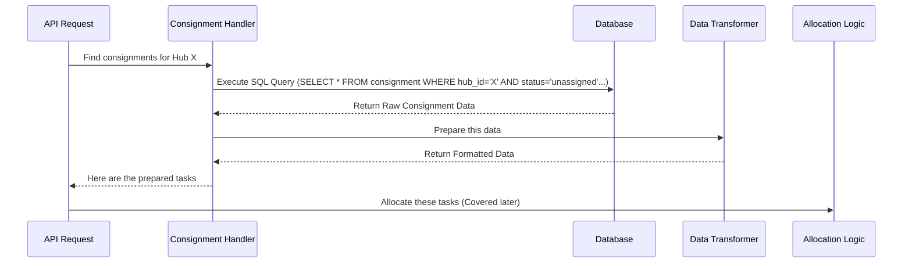

# Chapter 1: Consignment Data Handling

Welcome to the ProjectX tutorial! We're excited to guide you through the core concepts of our task allocation system. In this first chapter, we'll explore how the system gathers and prepares the delivery tasks, known as "consignments," before they can be assigned to delivery workers.

## What's the Big Idea?

Imagine you're a dispatcher at a busy delivery hub. Before you can tell your drivers where to go, you need to know *what* needs delivering. You'd probably start by grabbing all the new delivery slips from an inbox or a pile on your desk.

That's essentially what "Consignment Data Handling" is all about in ProjectX. It's the first crucial step: **finding and preparing the list of delivery tasks (consignments) that are ready to be assigned.**

Think of it like this:
1.  **Gathering:** The system needs to find all the delivery requests (consignments) that haven't been assigned yet or have just arrived at the hub.
2.  **Checking:** Just like you'd glance at a delivery slip, the system checks important details:
    *   Is this delivery actually ready to go? (Status like 'reachedathub', 'unassigned')
    *   Does it need to be delivered within a specific time window?
    *   Are there any special flags, like "Okay for automatic assignment"? (`eligible_for_auto_allocation`)
    *   Is it a specific type of order (e.g., express, standard)?
3.  **Sorting & Preparing:** Once gathered and checked, the information needs to be organized and formatted so the next part of the system (the allocation logic) can easily understand it.

This step ensures we only try to assign tasks that are actually ready and eligible, making the whole delivery process much smoother.

## Fetching the Right Consignments

The system interacts with a database (think of it as a super organized digital filing cabinet) to find the consignments. It uses specific instructions, written in a language called SQL (Structured Query Language), to ask the database for the right information.

Let's look at a simplified idea of what the system asks the database:

```sql
-- Find consignments that need assigning
SELECT
    reference_number, -- Unique ID for the delivery
    status,           -- Current status (like 'reachedathub')
    hub_id,           -- Which delivery hub it belongs to
    softdata_upload_time, -- When the order info was received
    extra_details     -- Other info like time windows, order type
FROM
    consignment       -- The table storing consignment data
WHERE
    organisation_id = 'your_company_id' -- Make sure it's for the right company
    AND hub_id = 'hub123'              -- Only for this specific hub
    AND status IN ('reachedathub', 'unassigned') -- Only specific statuses
    AND eligible_for_auto_allocation = TRUE    -- Must be flagged as eligible
    AND softdata_upload_time >= '2023-10-26 09:00:00' -- Within a certain timeframe
    AND softdata_upload_time < '2023-10-27 09:00:00';
```

*   **SELECT ... FROM consignment:** We're asking for specific columns (like `reference_number`, `status`) from the `consignment` table.
*   **WHERE ...:** This is where we filter!
    *   `organisation_id` and `hub_id`: Ensures we only get tasks for the correct company and delivery center.
    *   `status IN (...)`: We only want consignments with statuses like 'reachedathub' (it arrived!) or 'unassigned' (it needs a driver!).
    *   `eligible_for_auto_allocation = TRUE`: A flag indicating the system is allowed to automatically assign this task.
    *   `softdata_upload_time >= ... AND softdata_upload_time < ...`: We often only look for tasks within a certain time range (e.g., today's tasks).

This query helps gather *only* the relevant delivery slips from the massive digital filing cabinet.

## Preparing the Data for Allocation

Once the system fetches the raw data from the database, it's often not in the perfect format for the next step – deciding *which* worker gets *which* task. The data needs to be transformed or prepared.

Imagine taking the information from the delivery slip (address, deadline, package size) and typing it neatly into a spreadsheet or a planning tool for the dispatcher. The system does something similar:

*   It might extract specific details from the `extra_details` column (like delivery time windows, customer notes, or package dimensions).
*   It might calculate coordinates (latitude, longitude) for addresses.
*   It ensures the data fields have the correct names and types that the allocation logic expects.

For example, the raw data might look like this (simplified):

```json
{
  "reference_number": "DELIVERY_XYZ",
  "status": "reachedathub",
  "extra_details": "{\"tw_open\": \"14:00\", \"tw_close\": \"16:00\", \"weight_kg\": 2}"
  // ... other fields
}
```

After transformation, it might look like this, ready for the allocation system:

```json
{
  "task_id": "DELIVERY_XYZ",
  "pickup_location": { "lat": 12.9716, "lng": 77.5946 }, // Hub location
  "delivery_location": { "lat": 12.9800, "lng": 77.6000 }, // Customer location
  "time_window_start": "14:00",
  "time_window_end": "16:00",
  "required_capacity": { "weight": 2 }
  // ... other relevant fields
}
```

This preparation makes it much easier for the next part of the system, the [Task Allocation Endpoint](03_task_allocation_endpoint.md), to understand and process the tasks.

## Under the Hood: A Quick Look

How does this happen in the actual code? Several parts of the system might be involved, depending on the specific type of allocation needed (like for regular deliveries, on-demand tasks, etc.). You'll often find this logic within files related to task allocation APIs.

Let's visualize the basic flow:



1.  An external system (or a scheduled job) sends a request to an API endpoint (like `/tmsTaskAllocation` or `/ondemandTaskAllocation`) asking to process tasks for a specific hub.
2.  The code handling this request (the **Consignment Handler**) figures out the exact criteria (status, time, eligibility) based on the request and system configuration.
3.  It constructs and executes an SQL query against the **Database**.
4.  The Database returns the matching raw consignment data.
5.  A **Data Transformer** takes this raw data and reshapes it into the structured format needed by the **Allocation Logic** (which we'll cover in later chapters like [Allocation Strategy Execution](05_allocation_strategy_execution.md)).
6.  The prepared data is then ready for the next stage.

Files like `common/models/internal-api-parts/jfl-parts/ondemand-task-allocation.js` or `tms-task-allocation.js` contain the code that performs these steps – defining the queries, fetching data using helper functions like `helper.executeQueryAsync`, and transforming it.

For instance, a snippet inside might look conceptually like this (highly simplified):

```javascript
// Inside an allocation function for a specific hub_id...

// 1. Define criteria
const statusToFetch = ['reachedathub', 'unassigned'];
const allocationTimeLimit = new Date(); // Get current time - lag
const startTimeLimit = getStartOfOperationDay(); // Get start time

// 2. Build the SQL Query (Simplified concept)
const consignmentQuery = `
  SELECT reference_number, status, extra_details -- and other needed fields
  FROM consignment
  WHERE hub_id = $1
    AND status = ANY($2) -- Check against the list of statuses
    AND eligible_for_auto_allocation = TRUE
    AND softdata_upload_time < $3 -- Before the allocation cutoff
    AND softdata_upload_time >= $4; -- After the start of the relevant period
`;
const queryParams = [hubId, statusToFetch, allocationTimeLimit, startTimeLimit];

// 3. Fetch data from the database
const rawConsignments = await helper.executeQueryAsync(extendedModels.Consignment, consignmentQuery, queryParams);

// 4. Transform the data (Simplified concept)
const tasksForAllocator = rawConsignments.map(consignment => {
  return {
    taskId: consignment.reference_number,
    // ... extract and format other details needed by the allocator
    timeWindowStart: consignment.extra_details.delivery_time_slot_start,
    timeWindowEnd: consignment.extra_details.delivery_time_slot_end,
    // ...
  };
});

// Now tasksForAllocator is ready for the next step!
```

This code fetches the data based on our criteria and then loops through the results (`rawConsignments.map(...)`) to create a new, cleaned-up list (`tasksForAllocator`) ready for assignment.

## Conclusion

Great job! You've learned about the first essential step in ProjectX's task allocation process: Consignment Data Handling. You now understand:

*   **Why** we need to gather and prepare consignment data (like sorting delivery slips).
*   **What** criteria the system uses to find the right tasks (status, time, eligibility).
*   **How** the system fetches data (using SQL queries) and transforms it into a usable format.

This prepared list of tasks is crucial for the next steps. Now that we have the "what" (the tasks), we need the "who" – the workers available to perform these tasks.

Let's move on to the next chapter to see how the system handles worker data!

**Next:** [Chapter 2: Worker Data Handling](02_worker_data_handling.md)

---

Generated by [AI Codebase Knowledge Builder](https://github.com/The-Pocket/Tutorial-Codebase-Knowledge)