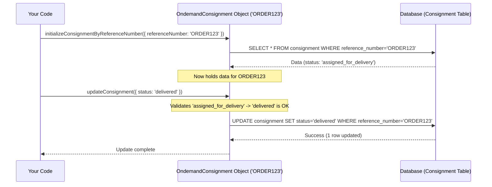

# Chapter 1: Ondemand Consignment Model - Your Digital Work Ticket

Welcome to the `projectx` tutorial! We're starting our journey by looking at the most fundamental piece of our on-demand delivery system: the **Ondemand Consignment Model**.

## What's the Big Idea?

Imagine you order pizza online. Your single order – from the pizza place to your doorstep – needs to be tracked. It has specific details: what you ordered (though we focus on delivery aspects like weight), where it's coming from, where it's going, when it should arrive, and who is delivering it.

In `projectx`, each individual delivery order like this is represented by an **Ondemand Consignment**. Think of it like a digital **work ticket** or a **shipping label** for a single delivery task. It's the system's way of keeping track of everything related to that one specific job.

## What's on the "Work Ticket"?

Our digital work ticket, the `OndemandConsignment`, holds all the crucial information for a single delivery:

1.  **Reference Number:** A unique ID for this specific delivery, like an order number (e.g., `ORDER123`).
2.  **Pickup & Delivery Details:**
    *   Addresses: Where to pick up the package (e.g., the restaurant) and where to deliver it (e.g., the customer's house).
    *   Time Windows: Any specific time constraints for pickup or delivery (e.g., deliver between 7 PM and 8 PM).
3.  **Package Info:** Characteristics of the item being delivered, mainly its `weight`.
4.  **Current Status:** Where is this delivery in its lifecycle? Examples:
    *   `unassigned`: The order is waiting for a delivery worker.
    *   `assigned_for_delivery`: A worker has accepted the job.
    *   `delivered`: The package reached its destination successfully!
    *   `attempted`: The worker tried to deliver, but couldn't (e.g., customer wasn't home).
5.  **Constraint Tags:** Any special requirements or conditions for this delivery. For example, does it need a specific type of vehicle ("requires_car") or handling ("fragile")? We'll dive deeper into this in the [Constraint Tag System](04_constraint_tag_system.md) chapter. It can also have temporary tags, like "no_doorbell_after_9pm" that expire after a certain time.
6.  **Payment Details:** If it's a Cash-On-Delivery (COD) order, how much money needs to be collected?
7.  **Assignment Info:** Which delivery [Ondemand Worker Model](02_ondemand_worker_model.md) is currently responsible for this task, and which delivery `trip` (a sequence of tasks for a worker) does it belong to?

## What Can You Do With It?

The `OndemandConsignment` isn't just static information; it's interactive. You can use it to:

*   **Update its state:** Change the status (e.g., mark it as `delivered` when the worker completes the job).
*   **Assign it:** Give the delivery task to a specific [Ondemand Worker Model](02_ondemand_worker_model.md).
*   **Unassign it:** Take the task away from a worker if needed (e.g., their shift ended).

## Using the Ondemand Consignment (Code Examples)

Let's see how you might interact with a consignment in code. Don't worry if some parts look complex; focus on the *idea* of interacting with our digital work ticket.

**1. Loading a Specific Consignment**

Before you can do anything with a delivery order, you need to load its information. We use the `OndemandConsignment` class for this.

```javascript
// Import the class that represents our digital work ticket
const OndemandConsignment = require('../../../domain-models/ondemand-handler/ondemand-consignment-class/ondemand-consignment-class');

// --- Simplified Setup ---
// We need some context like which organization this belongs to ('organisationId')
// and tools to talk to the database ('extendedModels').
// Assume these are already set up for us.
const odc = new OndemandConsignment({
    organisationId: 'YOUR_ORG_ID',
    extendedModels: /* Database tools */,
    source: 'tutorial_chapter_1', // Where is this code running from?
    creatorType: 'user',          // Who initiated this? (e.g., 'user', 'script')
    creatorId: 'user_xyz'         // Specific user/script ID
});

// Let's find and load the details for delivery order 'ORDER123'
// (We often do this inside a 'transaction' for safety, like saving multiple changes at once)
try {
    const { requiredConsignment } = await odc.initializeConsignmentByReferenceNumber(
        { referenceNumber: 'ORDER123' },
        { transaction: /* Active database transaction */ }
    );

    // Success! 'odc' now holds all the info for ORDER123.
    // 'requiredConsignment' is the actual data object.
    console.log(`Loaded consignment: ${requiredConsignment.reference_number}`);
    console.log(`Status: ${requiredConsignment.status}`); // e.g., 'unassigned'

} catch (error) {
    console.error("Could not load consignment:", error);
    // Handle cases where the order doesn't exist
}
```

This code creates an `OndemandConsignment` object and then tells it to load the data for the specific order `ORDER123` from the database. Now the `odc` object represents that specific delivery.

**2. Updating Consignment Details (Example: Adding a Temporary Tag)**

Sometimes, details change. Maybe the customer calls with a last-minute instruction. We can use the `OndemandConsignment` object to update the record. This example shows adding a temporary constraint tag.

```javascript
// (Continuing from above, assuming 'odc' holds data for 'ORDER123')

// Let's say the customer requested 'no_doorbell' for the next hour
const temporaryTag = 'no_doorbell';
const oneHourInSeconds = 3600;
const expiryTime = Date.now() + oneHourInSeconds * 1000; // Current time + 1 hour

try {
    // Prepare the update data: a list of time-restricted tags
    const updateData = {
        time_restricted_constraint_tags: [{
            tag_id: temporaryTag,
            expiry: expiryTime
        }]
    };

    // Tell the 'odc' object to update itself in the database
    await odc.updateConsignment(
        {
            eventTime: new Date(), // Record when this update happened
            consignmentParams: updateData
        },
        { transaction: /* Active database transaction */ }
    );

    console.log(`Updated ${odc.requiredConsignment.reference_number} with tag '${temporaryTag}'`);

} catch (error) {
    console.error("Could not update consignment:", error);
}
```

Here, we used the `odc` object (which knows it represents `ORDER123`) and called its `updateConsignment` method to save the new temporary tag to the database.

**3. Assigning/Unassigning (Conceptual)**

Assigning a delivery to a worker is a core function. The `OndemandConsignment` class has methods like `assignToWorker` and `unassignWorker`.

```javascript
// (Assuming 'odc' holds data for 'ORDER123')
// (Assuming 'worker007' is a valid worker ID)

try {
    // Assign ORDER123 to worker 'worker007'
    await odc.assignToWorker({
        workerId: 'worker007',
        eventTime: new Date(),
        currentTime: new Date(),
        // ... other necessary details ...
    }, { transaction: /* Active database transaction */ });
    console.log(`Assigned ${odc.requiredConsignment.reference_number} to worker007.`);
    // The consignment status might now be 'assigned_for_delivery'

    // --- Later ---

    // Maybe we need to unassign it
    await odc.unassignWorker({
        workerId: 'worker007', // Important to specify who it's unassigned from
        reason: 'Worker shift ended unexpectedly',
        eventTime: new Date(),
        currentTime: new Date(),
        // ... other necessary details ...
    }, { transaction: /* Active database transaction */ });
    console.log(`Unassigned ${odc.requiredConsignment.reference_number} from worker007.`);
    // The consignment status might now be back to 'unassigned'

} catch (error) {
    console.error("Error assigning/unassigning:", error);
}
```

These methods handle the complex logic of linking the consignment to a worker's trip and updating statuses, which involves interactions with the [Ondemand Worker Model](02_ondemand_worker_model.md). We see these actions used in files like `aster-task-allocation.js` for automatic assignment.

## Under the Hood: How Updates Happen

When you call a method like `updateConsignment`, what actually happens?

1.  **Load Data:** The `OndemandConsignment` object makes sure it has the latest data for the specific consignment from the database (usually done during `initializeConsignmentByReferenceNumber`).
2.  **Validate:** It might check if the requested change is valid (e.g., can you change the status from `delivered` back to `unassigned`? Probably not!).
3.  **Prepare Update:** It figures out exactly which fields in the database need to change.
4.  **Database Interaction:** It sends the update command to the database (specifically, the `consignment` table). This is often done within a *transaction* – a safety mechanism ensuring that either all related changes succeed together, or none of them do (preventing inconsistent data).
5.  **Post-Update Actions:** It might trigger notifications or other processes after the update is successful.

Here's a simplified view of updating a consignment's status:



**Code Location:**

The main logic lives in:
`common/domain-models/ondemand-handler/ondemand-consignment-class/ondemand-consignment-class.js`

Inside this file, you'll find the `OndemandConsignment` class with methods like:

*   `initializeConsignmentByReferenceNumber`: Fetches the data.
*   `updateConsignment`: Saves changes.
*   `assignToWorker`: Links to a worker.
*   `unassignWorker`: Removes the link from a worker.

Functions in other files, like `updateTimeRestrictedConstraintTags` in `common/models/internal-api-parts/jfl-parts/allocation-cn-utils.js`, often *use* an `OndemandConsignment` object to perform their tasks safely within a database transaction.

```javascript
// Inside common/models/internal-api-parts/jfl-parts/allocation-cn-utils.js
// Simplified view of using the OndemandConsignment object

const OndemandConsignment = require(/* path to class */);
const helper = require(/* path to helper */); // Provides commit/rollback

async function someConsignmentUpdateFunction(params, options) {
    let transaction = null;
    try {
        // Start a database transaction for safety
        transaction = await extendedModels.Consignment.beginTransaction(/* config */);

        // Create an instance to work with consignments
        const odc = new OndemandConsignment({ /* setup */ });

        // 1. Load the specific consignment using its reference number
        await odc.initializeConsignmentByReferenceNumber(
            { referenceNumber: params.referenceNumber },
            { transaction } // Perform within the transaction
        );

        // 2. Prepare the changes needed
        const updatePayload = { /* data to change */ };

        // 3. Use the object's method to apply the update
        await odc.updateConsignment(
            { consignmentParams: updatePayload },
            { transaction } // Perform within the transaction
        );

        // 4. If all steps worked, save changes permanently
        await helper.commit(transaction);

    } catch (error) {
        // 5. If anything failed, undo all changes made in the transaction
        if (transaction) await helper.rollback(transaction);
        console.error("Update failed:", error);
        throw error; // Pass the error along
    }
}
```

This pattern (start transaction, load, update using object methods, commit/rollback) is common when working with `OndemandConsignment`.

## Conclusion

You've just learned about the `OndemandConsignment` - the fundamental building block for tracking individual delivery tasks in `projectx`. It's our digital work ticket, holding all the vital details and allowing us to manage the delivery's lifecycle from start to finish.

Now that we understand how a single delivery job is represented, let's meet the people (or system entities) who actually perform these deliveries. In the next chapter, we'll explore the [Ondemand Worker Model](02_ondemand_worker_model.md).

---

Generated by [AI Codebase Knowledge Builder](https://github.com/The-Pocket/Tutorial-Codebase-Knowledge)