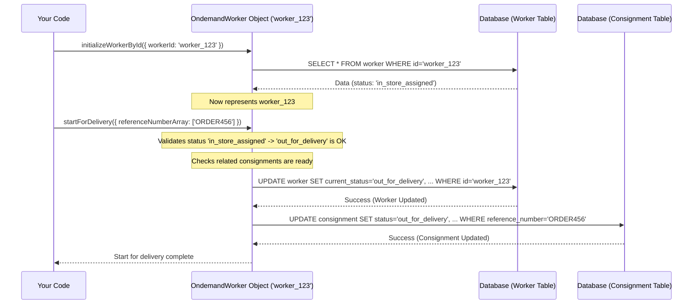

# Chapter 2: Ondemand Worker Model - Your Digital Driver ID

Welcome back! In [Chapter 1: Ondemand Consignment Model](01_ondemand_consignment_model.md), we learned how `projectx` represents a single delivery job as a digital "work ticket". But who actually *does* the delivery? We need a way to represent the delivery workers in our system.

That's where the **Ondemand Worker Model** comes in.

## What's the Big Idea?

Imagine you have a team of delivery drivers. Each driver has specific details: their name, maybe an employee ID, what vehicle they use (bike, car?), are they currently working, busy, or available?

The `OndemandWorker` model is like a **digital ID card** or **profile** for each delivery worker in `projectx`. It holds all the important information about a worker and allows the system to manage their work lifecycle.

Think about our pizza delivery example from Chapter 1. Once the `OndemandConsignment` (the work ticket) is created, the system needs to find a suitable driver. How does it know which drivers are available, nearby, and capable of delivering the pizza? It looks at the digital ID cards – the `OndemandWorker` profiles.

## What's on the "Digital ID Card"?

Our `OndemandWorker` profile contains key details about the worker:

1.  **Worker ID & Code:** Unique identifiers for the worker (e.g., `worker_123`, `WKR007`).
2.  **Current Status:** What is the worker doing right now?
    *   `in_store`: Available at the hub (e.g., restaurant), waiting for orders.
    *   `in_store_assigned`: At the hub, has orders assigned but hasn't left yet.
    *   `out_for_delivery`: On the road, delivering orders.
    *   `returning_to_store`: Finished deliveries, heading back to the hub.
    *   `off_duty`: Not currently working.
    *   `outside_geofence`: Outside the designated working area (if geofencing is used).
3.  **Assigned Hub:** Which main location (store, warehouse) is this worker based at?
4.  **Vehicle Details:** What kind of vehicle are they using? (e.g., 'bike', 'car'). This is important for matching tasks (a large package might need a car).
5.  **Constraint Tags (Skills/Capabilities):** Does the worker have special skills or qualifications? Examples: "can_handle_heavy", "trained_for_cold_storage". This uses the [Constraint Tag System](04_constraint_tag_system.md).
6.  **Performance Metrics:** How well has the worker been performing? (e.g., average delivery time, ratings - though we won't dive deep into this here).
7.  **Cash Handling (COD) Info:** If they handle Cash-On-Delivery, how much cash are they currently holding? Is there a limit?

## What Can This "Digital ID" Do?

The `OndemandWorker` isn't just a static profile; it's dynamic and helps manage the worker's activities:

*   **Change Status:** Update the worker's status (e.g., mark them as `out_for_delivery` when they leave the store).
*   **Assign Orders:** Link an [Ondemand Consignment Model](01_ondemand_consignment_model.md) (a delivery task) to this worker.
*   **Unassign Orders:** Remove a task from the worker if needed.
*   **Validate Eligibility:** Check if the worker is suitable for a specific task. Can they accept new orders based on their current status? Do they meet the requirements (like having the right vehicle type or skills via [Constraint Tag System](04_constraint_tag_system.md))? Can they handle more COD orders?
*   **Manage Lifecycle:** Handle events like starting a shift, going on break, returning to the hub, and ending a shift.

## Using the Ondemand Worker (Code Examples)

Let's see how we might interact with a worker's profile in code. Again, focus on the *idea* rather than memorizing the exact code.

**1. Loading a Worker's Profile**

Just like with consignments, we first need to load the worker's information. We use the `OndemandWorker` class.

```javascript
// Import the class representing our digital worker ID
const OndemandWorker = require('../../../domain-models/ondemand-handler/ondemand-worker-class/ondemand-worker-class');
// Assume extendedModels (database tools) and organisationId are set up

// Create an object to interact with worker data
const odw = new OndemandWorker({
    organisationId: 'YOUR_ORG_ID',
    extendedModels: /* Database tools */,
    source: 'tutorial_chapter_2',
    creatorType: 'user',
    creatorId: 'user_abc'
});

const workerIdToLoad = 'worker_123';

try {
    // Load the profile for worker 'worker_123'
    // (Often done inside a 'transaction' for safety)
    const { requiredWorker } = await odw.initializeWorkerById(
        { workerId: workerIdToLoad },
        { transaction: /* Active database transaction */ }
    );

    // Success! 'odw' now represents worker_123.
    // 'requiredWorker' holds the actual data.
    console.log(`Loaded worker: ${requiredWorker.worker_code}`); // e.g., WKR007
    console.log(`Current Status: ${requiredWorker.current_status}`); // e.g., 'in_store'

} catch (error) {
    console.error(`Could not load worker ${workerIdToLoad}:`, error);
    // Handle cases where the worker doesn't exist
}
```

This code creates an `OndemandWorker` object and tells it to load the profile for `worker_123`. The `odw` object now acts as our handle for that specific worker.

**2. Assigning an Order to a Worker**

This is a core operation, often performed by the [Task Allocation Orchestrator (Aster)](03_task_allocation_orchestrator__aster_.md). The `OndemandWorker` object has methods to handle assignment safely.

```javascript
// (Continuing from above, assuming 'odw' holds data for 'worker_123')
// (Assume 'ORDER456' is the reference number of an unassigned consignment)

const orderReferenceNumber = 'ORDER456';
const now = new Date();

try {
    // First, validate if the worker *can* take this order
    // (Conceptual - validation happens before assignment)
    // await odw.validateWorkerForAssign({}, { transaction: /* ... */ });
    // await odw.validateConsignmentForWorker({ /* consignment details */ }, { transaction: /* ... */ });

    // If validation passes, assign the order
    await odw.assignOrders(
        {
            referenceNumber: orderReferenceNumber,
            eventTime: now,
            currentTime: now,
            allowInStoreAssignmentsOnly: true // e.g., worker must be at the hub
            // ... other necessary details like position in trip ...
        },
        { transaction: /* Active database transaction */ }
    );

    console.log(`Assigned order ${orderReferenceNumber} to worker ${odw.requiredWorker.worker_code}`);
    // The worker's status might change (e.g., to 'in_store_assigned')
    // The consignment's status will also change (e.g., to 'assigned_for_delivery')

} catch (error) {
    console.error(`Failed to assign ${orderReferenceNumber} to ${odw.requiredWorker.worker_code}:`, error);
    // Handle errors like worker became unavailable, order already assigned, etc.
}
```

Here, we use the `odw` object (representing `worker_123`) and call its `assignOrders` method. This method handles the complex logic of linking the worker to the [Ondemand Consignment Model](01_ondemand_consignment_model.md), updating statuses for both, potentially adding the task to the worker's current `trip`, and ensuring all rules are followed.

**3. Changing Worker Status (Example: Starting Delivery)**

When a worker leaves the store to start deliveries, their status needs updating.

```javascript
// (Continuing from above, assuming 'odw' holds data for 'worker_123')
// (Assume worker_123 has orders assigned and is 'in_store_assigned')

const now = new Date();
// Get the list of orders the worker is taking
const ordersBeingStarted = ['ORDER456' /*, maybe others */];

try {
    await odw.startForDelivery(
        {
            referenceNumberArray: ordersBeingStarted,
            eventTime: now,
            currentTime: now,
            lat: 12.9716, // Current location when starting
            lng: 77.5946
        },
        { transaction: /* Active database transaction */ }
    );

    console.log(`Worker ${odw.requiredWorker.worker_code} started for delivery.`);
    // The worker's status is now likely 'out_for_delivery'.
    // The status of the associated consignments might also be updated.

} catch (error) {
    console.error(`Error updating status for worker ${odw.requiredWorker.worker_code}:`, error);
}
```

The `startForDelivery` method updates the worker's status and potentially updates the related consignments (e.g., marking them as having left the store). Similarly, methods like `returnedToHub` update the status when the worker gets back.

## Under the Hood: How Does It Work?

When you call a method like `assignOrders` or `startForDelivery` on an `OndemandWorker` object:

1.  **Load Data:** The object ensures it has the latest data for the specific worker from the database (usually done during `initializeWorkerById`).
2.  **Validate:** It performs crucial checks. *Can* the worker perform this action? Are they in the correct status? Do they meet constraints? Is the order assignable? (e.g., `validateWorkerForAssign`).
3.  **Prepare Updates:** It figures out what needs to change in the `worker` table (like `current_status`, `last_status_change_time`) and potentially in related tables like `consignment` or `task`.
4.  **Database Interaction:** It sends update commands to the database, often within a transaction to ensure data consistency. If assigning an order, it updates both the worker and the consignment.
5.  **Post-Update Actions:** It might trigger other processes, like sending notifications to the worker's app or updating analytics.

Here’s a simplified view of a worker starting their delivery:



**Code Location:**

The main logic for the worker profile lives in:
`common/domain-models/ondemand-handler/ondemand-worker-class/ondemand-worker-class.js`

Inside this file, you'll find the `OndemandWorker` class containing methods like:

*   `initializeWorkerById` / `initializeWorkerByCode`: Load the worker profile.
*   `assignOrders`: Assign a delivery task to the worker.
*   `unassignOrders`: Remove a task from the worker.
*   `startForDelivery`: Update status when the worker leaves the hub.
*   `returnedToHub`: Update status when the worker returns.
*   `validateWorkerForAssign`: Check if the worker can be assigned tasks.
*   `validateConsignmentForWorker`: Check if the worker is suitable for a *specific* consignment.

You'll see these methods being used in orchestrator logic, like in `aster-task-allocation.js`, which decides *which* worker gets an order and then uses the `OndemandWorker` object to perform the assignment.

```javascript
// Inside common/models/internal-api-parts/jfl-parts/aster-task-allocation.js
// Highly simplified view of how assignTaskToWorker might use OndemandWorker

const OndemandWorker = require(/* path to class */);
const OndemandConsignment = require(/* path to class */);
const helper = require(/* path to helper */); // Provides commit/rollback

async function assignTaskToWorker(organisationId, extendedModels, params, options) {
    const { worker_id: workerId, task_list = [] } = params;
    let transaction = null;
    try {
        transaction = await extendedModels.Consignment.beginTransaction(/* config */);

        // 1. Create & Load the Worker's Profile
        const odw = new OndemandWorker({ organisationId, extendedModels, /* setup */ });
        await odw.initializeWorkerById({ workerId }, { transaction });

        // 2. Validate the Worker (and potentially each task)
        // (Simplified - actual validation is more complex)
        await odw.validateWorkerForAssign({ /* conditions */ }, { transaction });

        // 3. Loop through tasks to assign
        for (const task of task_list) {
            const odc = new OndemandConsignment({ organisationId, extendedModels, /* setup */ });
            await odc.initializeConsignmentByReferenceNumber(
                { referenceNumber: task.reference_number },
                { transaction }
            );

            // 3a. Validate specific consignment against worker (skills, capacity etc.)
            // await odw.validateConsignmentForWorker({ requiredConsignment: odc.requiredConsignment }, { transaction });

            // 3b. Perform the assignment using the OndemandConsignment object
            await odc.assignToWorker({
                 workerId: odw.requiredWorker.id,
                 /* eventTime, currentTime, etc. */
             }, { transaction });

            // 3c. Update Worker status if needed (e.g., first assignment)
             if (odw.requiredWorker.current_status === 'in_store') {
                 await odw.requiredWorker.updateAttributes(
                     { current_status: 'in_store_assigned' },
                     { transaction }
                 );
             }
        }

        // 4. Commit all changes if everything succeeded
        await helper.commit(transaction);

    } catch (error) {
        if (transaction) await helper.rollback(transaction);
        console.error("Assignment failed:", error);
        // Handle assignment failure
    }
}
```

## Conclusion

We've now met the **Ondemand Worker Model** – the digital representation of our delivery drivers. It holds their key details, tracks their status, manages their assignments, and ensures they are eligible for tasks. It's the crucial link between the work that needs doing ([Ondemand Consignment Model](01_ondemand_consignment_model.md)) and the people who do it.

But how does the system *decide* which available worker is the *best* fit for a particular delivery task? That's where the magic of automation comes in. In the next chapter, we'll explore the brain of the operation: the [Task Allocation Orchestrator (Aster)](03_task_allocation_orchestrator__aster_.md).

---

Generated by [AI Codebase Knowledge Builder](https://github.com/The-Pocket/Tutorial-Codebase-Knowledge)