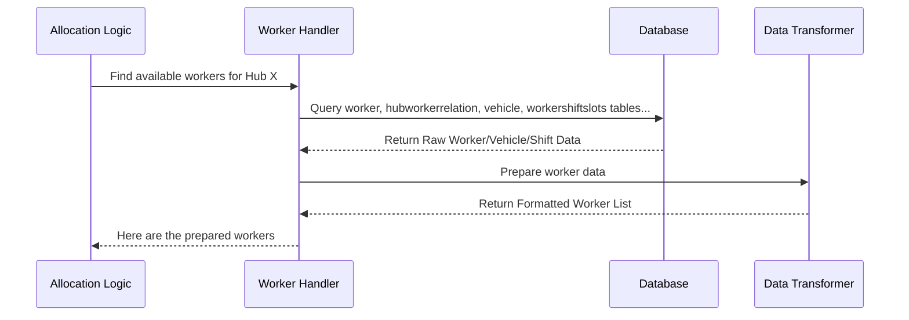

# Chapter 2: Worker Data Handling

In [Chapter 1: Consignment Data Handling](01_consignment_data_handling.md), we learned how ProjectX gathers and prepares the list of delivery tasks ("consignments") that need to be assigned. We figured out *what* needs to be delivered. Now, we need to figure out *who* can deliver it!

This chapter focuses on **finding and evaluating the available workforce** (like riders or drivers) for these tasks.

## What's the Big Idea?

Imagine our dispatcher again. After sorting the delivery slips (consignments), their next step is to look at their team. They need to know:

*   Who is actually working right now?
*   Are they available, or are they on a break or already out on a delivery?
*   What kind of vehicle are they using (a bike, a van)? How much can it carry?
*   Do they have any special qualifications (e.g., trained to handle fragile items)?
*   How many deliveries are they already handling?

"Worker Data Handling" in ProjectX is exactly this: checking the status and capabilities of all the workers associated with a specific delivery hub to see who is suitable for the tasks we gathered in Chapter 1.

## What Information Do We Need About Workers?

To make good assignment decisions, the system needs several pieces of information about each worker:

1.  **Who Works Here?** Which workers are assigned to the specific `hub_id` we're currently processing tasks for?
2.  **Are They On Duty?** What's their current status? Common statuses include:
    *   `onduty`: Clocked in and working.
    *   `in_store`: On duty and physically at the hub (or ready for tasks).
    *   `on_break`: Clocked in, but temporarily unavailable.
    *   `offduty`: Not currently working.
    *   *(We usually only care about workers who are `onduty` or `in_store` for new assignments).*
3.  **When Are They Working?** What are their scheduled shift times for today? We need to know if they'll be available during the required delivery times.
4.  **What Can They Carry?**
    *   **Vehicle Type:** Are they on a `CYCLE`, `SCOOTER`, `VAN`?
    *   **Capacity:** How many orders can they typically handle (`consignment_capacity`)? What's the maximum weight (`weight`) they can carry?
5.  **Special Skills/Requirements (`constraint_tags`)**: Does the worker (or their vehicle) have specific attributes? These are like tags, for example:
    *   `refrigerated`: Can carry items needing cooling.
    *   `heavy_goods_license`: Licensed for large/heavy items.
    *   `cash_handling`: Allowed to collect Cash on Delivery (COD).
    *   These tags help match workers to tasks with specific needs (we'll cover this more in [Constraint Matching Logic](06_constraint_matching_logic.md)).
6.  **Current Workload**: How many tasks are they *already* assigned or currently delivering? This helps avoid overloading a worker.
7.  **(Optional) Location/Activity**: Sometimes, the system might check the worker's last known GPS location or when they were last active to estimate their current position or availability.

Gathering all this information gives the system a clear picture of the available workforce, just like a dispatcher looking at their live status board.

## Finding the Right Workers: Asking the Database

Similar to how we found consignments, the system queries the database (our digital filing cabinet) to find worker information. It often needs to combine data from several tables.

**1. Finding Workers for a Hub:**

First, we need to find all *active* workers associated with a specific hub. We might look in a `worker` table and a `hubworkerrelation` table (which links workers to hubs).

```sql
-- Find active workers linked to Hub 'hub123'
SELECT
    worker.id AS worker_id,         -- Unique worker ID
    worker.worker_code,            -- Human-readable code (e.g., RIDER007)
    worker.current_status,         -- e.g., 'onduty', 'in_store'
    worker.is_active,              -- Is the worker account generally active?
    worker.vehicle_id              -- ID of the vehicle they are using
FROM
    worker
INNER JOIN
    hubworkerrelation hwr ON hwr.worker_id = worker.id -- Link workers to hubs
WHERE
    hwr.hub_id = 'hub123'          -- Only for our target hub
    AND worker.is_active = TRUE;   -- Only consider active worker accounts
```

*   `SELECT ... FROM worker`: We're asking for details from the `worker` table.
*   `INNER JOIN hubworkerrelation ...`: We link `worker` to `hubworkerrelation` using the `worker_id` to filter by hub.
*   `WHERE hwr.hub_id = 'hub123' AND worker.is_active = TRUE`: We filter for the specific hub and ensure the worker's account is active.

**2. Getting Vehicle Details:**

Next, for each worker found, we need details about their vehicle (capacity, type, special tags). This might involve joining with a `vehicle` table.

```sql
-- Get vehicle details for a specific worker (e.g., worker_id 55)
SELECT
    vehicle.vehicle_category_id,      -- e.g., 'CYCLE', 'SCOOTER'
    vehicle.extra_details->'capacity' AS consignment_capacity, -- How many orders
    vehicle.extra_details->'weight_limit_kg' AS weight_limit, -- Max weight
    vehicle.extra_details->'constraint_tags' AS constraint_tags -- Special tags
FROM
    vehicle
WHERE
    vehicle.id = (SELECT vehicle_id FROM worker WHERE id = 55); -- Find vehicle linked to worker 55
```

*   This query fetches capacity, weight limit, and constraint tags stored in the `vehicle` table, often within a flexible `extra_details` field (like JSON).

**3. Checking Shifts:**

The system also needs to check shift schedules, often stored in a table like `workershiftslots`.

```sql
-- Find shifts for worker 55 that overlap with a specific time range
SELECT
    shift_start_time, -- e.g., '09:00:00'
    shift_end_time    -- e.g., '17:00:00'
FROM
    workershiftslots
WHERE
    worker_id = 55
    AND shift_date = '2023-10-27' -- For a specific date
    -- AND the shift overlaps with the needed delivery window (logic omitted for simplicity)
```

*   This finds the start and end times for the worker's shift on a given day. The system uses this to determine if the worker is available during the task's required time.

These queries (often combined into more complex ones) help gather all the necessary pieces of information about the workforce.

## Preparing the Worker Data

Just like with consignments, the raw data fetched from the database needs to be organized and formatted before the allocation logic can use it.

Imagine the dispatcher taking notes from the status board, shift schedule, and vehicle list, and compiling a neat summary for each available driver. The system does something similar:

*   It combines information from `worker`, `vehicle`, and `workershiftslots`.
*   It calculates the worker's *effective* availability window based on their shift and the current time.
*   It extracts vehicle capacity, weight limits, and constraint tags into a standard format.
*   It might assign a default capacity or speed if specific vehicle data is missing.
*   It might calculate a worker's priority based on factors like vehicle type or current workload.

**Raw Data Example (Conceptual):**

From `worker` table: `{ "id": 55, "worker_code": "RIDER007", "current_status": "in_store", "vehicle_id": 101 }`
From `vehicle` table: `{ "id": 101, "vehicle_category_id": "SCOOTER", "extra_details": {"capacity": 15, "weight_limit_kg": 20, "constraint_tags": ["cash_handling"]} }`
From `workershiftslots` table: `{ "worker_id": 55, "shift_date": "2023-10-27", "shift_start_time": "09:00:00", "shift_end_time": "17:00:00" }`

**Prepared Data Example (Conceptual):**

```json
{
  "worker_id": 55,
  "worker_code": "RIDER007",
  "status": "in_store", // Ready for tasks
  "vehicle_type": "SCOOTER",
  "capacity": {
    "orders": 15,
    "weight_kg": 20
  },
  "constraint_tags": ["cash_handling"],
  "availability_start_time": "2023-10-27T10:30:00Z", // Calculated based on shift and current time
  "availability_end_time": "2023-10-27T17:00:00Z",   // End of shift
  "current_load": 2, // Example: Already has 2 orders assigned
  "priority": 5 // Calculated priority score
}
```

This structured `worker` object is much easier for the allocation system (like the [Task Allocation Endpoint](03_task_allocation_endpoint.md)) to understand and use for matching workers to tasks.

## Under the Hood: A Quick Look

How does the system actually perform these steps? The logic resides within the code that handles task allocation requests, often interacting with database helper functions.



1.  The **Allocation Logic** (triggered by an API request or internal process) asks the **Worker Handler** for available workers for a specific hub.
2.  The **Worker Handler** constructs SQL queries (like the examples shown earlier) to fetch relevant data from the **Database**. This often involves functions like `fetchAllHubWorkers` and `fetchWorkersWithShiftBetweenTime` seen in files like `ondemand-task-allocation.js`.
3.  The **Database** returns the raw data.
4.  A **Data Transformer** (often part of the Worker Handler logic) processes this raw data, combines it, calculates derived values (like availability windows, capacity defaults), and formats it into a standardized list of worker objects.
5.  The prepared list of workers is returned to the **Allocation Logic**.

Let's look at a highly simplified conceptual code snippet inspired by `ondemand-task-allocation.js`:

```javascript
// Inside a function trying to find workers for a hub...

async function findAvailableWorkers(hubId, currentTime, allocationEndTime) {

  // 1. Fetch basic worker and vehicle details for the hub
  const workerDetailsQuery = `
    SELECT w.id as worker_id, w.worker_code, w.current_status,
           v.vehicle_category_id, v.extra_details
    FROM worker w
    JOIN hubworkerrelation hwr ON hwr.worker_id = w.id
    LEFT JOIN vehicle v ON v.id = w.vehicle_id
    WHERE hwr.hub_id = $1 AND w.is_active = TRUE AND w.onduty = TRUE;
    `;
  const workerDetailsParams = [hubId];
  const rawWorkers = await helper.executeQueryAsync(extendedModels.Worker, workerDetailsQuery, workerDetailsParams);

  // 2. Fetch shift details for these workers
  const workerIds = rawWorkers.map(w => w.worker_id);
  const shiftDetails = await extendedModels.WorkerShiftSlots.getWorkersShiftForDateTimeDuration(
      workerIds, currentTime, allocationEndTime, { timezone: 'Your/Timezone' }
  );

  // 3. Prepare the data for the allocator
  const preparedWorkers = [];
  for (const rawWorker of rawWorkers) {
    const workerShifts = shiftDetails[rawWorker.worker_id] || [];
    if (!workerShifts.length) {
      continue; // Skip workers with no relevant shift
    }

    // Only consider workers with allowed status
    if (!['in_store', 'onduty'].includes(rawWorker.current_status)) {
       continue;
    }

    // Extract vehicle info and set defaults
    const vehicleType = rawWorker.vehicle_category_id || 'DEFAULT_VEHICLE';
    const capacity = rawWorker.extra_details?.capacity || 10; // Default capacity
    const weightLimit = rawWorker.extra_details?.weight_limit_kg || 15; // Default weight
    const constraintTags = rawWorker.extra_details?.constraint_tags || [];

    // Process shifts to find availability (simplified)
    for (const shift of workerShifts) {
       // Simplified: Calculate actual start/end time based on shift and current time
       const availabilityStart = Math.max(shift.calculated_start_timestamp, currentTime);
       const availabilityEnd = shift.calculated_end_timestamp;

       if (availabilityEnd <= availabilityStart) continue; // Skip if shift already ended

       preparedWorkers.push({
         worker_id: rawWorker.worker_id,
         worker_code: rawWorker.worker_code,
         status: rawWorker.current_status,
         vehicle_type: vehicleType,
         capacity: { orders: capacity, weight_kg: weightLimit },
         constraint_tags: constraintTags,
         availability_start_time: new Date(availabilityStart).toISOString(),
         availability_end_time: new Date(availabilityEnd).toISOString(),
         // current_load: fetchCurrentLoad(rawWorker.worker_id), // Fetching load is complex, simplified here
         // priority: calculatePriority(rawWorker, vehicleType), // Priority calculation is complex
       });
    }
  }

  return preparedWorkers;
}
```

This simplified code shows the flow:
*   Fetch basic worker/vehicle info.
*   Fetch corresponding shift info.
*   Loop through workers, check status and shifts.
*   Extract and format vehicle details (with defaults).
*   Calculate availability windows.
*   Push the prepared worker object to a list.

This prepared list (`preparedWorkers`) is now ready to be used in the next stage to match tasks with the most suitable workers.

## Conclusion

Well done! You've now explored the second key part of ProjectX's allocation system: Worker Data Handling. You understand:

*   **Why** we need to find and evaluate workers (the "who" for the "what").
*   **What** information is crucial (status, shift, vehicle, capacity, skills, load).
*   **How** the system queries the database and prepares this data into a usable format for allocation.

We now have the prepared tasks (from Chapter 1) and the prepared list of available workers (from this chapter). The next step is to understand how the system actually receives the request to perform the allocation.

**Next:** [Chapter 3: Task Allocation Endpoint](03_task_allocation_endpoint.md)

---

Generated by [AI Codebase Knowledge Builder](https://github.com/The-Pocket/Tutorial-Codebase-Knowledge)