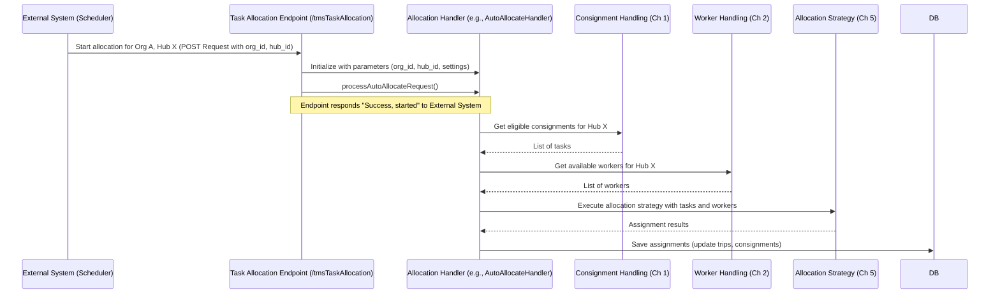

# Chapter 3: Task Allocation Endpoint

Welcome back! In [Chapter 1: Consignment Data Handling](01_consignment_data_handling.md), we saw how ProjectX gathers the delivery tasks (consignments), and in [Chapter 2: Worker Data Handling](02_worker_data_handling.md), we learned how it finds the available workers. We have the "what" (tasks) and the "who" (workers).

Now, how do we actually tell the system, "Okay, it's time to start assigning these tasks to these workers for Hub XYZ"? That's where the **Task Allocation Endpoint** comes in!

## What's the Big Idea?

Imagine our dispatch center again. We have the pile of delivery slips (consignments) and the list of drivers ready to go (workers). But nothing happens until someone *gives the command* to start assigning deliveries for a specific hub.

The Task Allocation Endpoint is like a dedicated **service counter** or a **starting button** for a specific type of task assignment process. External systems (like a scheduled job, or another part of the logistics software) send a request to this specific endpoint to say: "Please start the task allocation process for Hub 123 of Company ABC right now."

Think of these endpoints as clearly labeled counters:
*   Counter `/tmsTaskAllocation`: "Start assigning regular scheduled deliveries here."
*   Counter `/ondemandTaskAllocation`: "Start assigning urgent, on-demand deliveries here."
*   Counter `/asterTaskAllocation`: "Start assigning Pharmacy/Healthcare deliveries here."

When a request arrives at the correct counter (endpoint), it triggers the specific workflow for assigning those kinds of tasks for the requested hub.

## How Does It Work?

When an external system needs tasks to be assigned for a particular hub, it sends a message (an API request) to the specific URL endpoint defined in ProjectX. This message typically includes:

1.  **Which Company?** (`organisation_id`): So the system knows which company's data to use.
2.  **Which Hub?** (`hub_id`): So the system knows which delivery center's tasks and workers to consider.

Once the endpoint receives this request, it acts like a manager kicking off the process:

1.  **Acknowledge:** It receives the `organisation_id` and `hub_id`.
2.  **Delegate:** It triggers the main allocation logic for that specific hub and task type. This involves:
    *   Using the logic from [Chapter 1: Consignment Data Handling](01_consignment_data_handling.md) to fetch the relevant *tasks*.
    *   Using the logic from [Chapter 2: Worker Data Handling](02_worker_data_handling.md) to fetch the available *workers*.
    *   Passing this information to the next stages, like [Hub Selection Logic](04_hub_selection_logic.md) (if needed) and ultimately [Allocation Strategy Execution](05_allocation_strategy_execution.md), which figures out the best matches.

Essentially, the endpoint is the **main entry point** or **trigger** that puts all the pieces together and starts the assignment engine.

## Key Inputs: What You Need to Provide

To use a Task Allocation Endpoint, you typically need to send a request containing specific pieces of information. The most common ones are:

*   `organisation_id`: The unique identifier for the company or business unit.
*   `hub_id`: The unique identifier for the specific dispatch center or hub.

Here's a simplified example of what a request body might look like in JSON format when calling an endpoint like `/tmsTaskAllocation`:

```json
{
  "organisation_id": "your-company-123",
  "hub_id": "hub-melbourne-cbd"
}
```

Sending this data to the correct endpoint URL tells ProjectX precisely which set of tasks and workers need to be processed.

## Under the Hood: A Glimpse Inside

Let's peek behind the counter to see what happens when a request arrives.

**1. Receiving the Request:**

The system uses code to define these endpoints and listen for incoming requests. In ProjectX (which uses a framework called LoopBack), this might look something like this (simplified from `tms-task-allocation.js`):

```javascript
// Defines the '/tmsTaskAllocation' endpoint
InternalApi.remoteMethod('tmsTaskAllocation', {
  description: 'Adding new consignments to existing trips...',
  accepts: [
    // Defines the expected input parameters (like organisation_id, hub_id)
    { arg: 'params', type: 'object', http: { source: 'body' } },
    // ... other technical parameters (req, res)
  ],
  returns: {
    // Describes the expected response
    args: 'status',
    root: true
  },
  http: {
    // Specifies the URL path and the HTTP method (POST)
    path: '/tmsTaskAllocation',
    verb: 'post',
    status: 200 // Standard success code
  }
});
```

*   `remoteMethod('tmsTaskAllocation', ...)`: This registers a function named `tmsTaskAllocation` as an API endpoint.
*   `accepts: [...]`: Specifies that it expects data (`params`) sent in the request body.
*   `http: { path: '/tmsTaskAllocation', verb: 'post' }`: This sets the URL path and requires the request to be an HTTP POST request.

**2. Starting the Workflow:**

When a request hits `/tmsTaskAllocation`, the corresponding function (`InternalApi.tmsTaskAllocation` in this case) runs. Here’s a highly simplified conceptual version of what that function might do:

```javascript
// This function runs when '/tmsTaskAllocation' is called
InternalApi.tmsTaskAllocation = async (params = {}, req, res) => {
  try {
    // 1. Get the essential inputs from the request
    const { organisation_id: organisationId, hub_id: hubId } = params;
    console.log(`Received request to allocate tasks for Org: ${organisationId}, Hub: ${hubId}`);

    // Basic checks (ensure IDs are present)
    if (!organisationId || !hubId) {
      throw new Error("Organisation ID and Hub ID are required!");
    }

    // --- This is the core action ---
    // 2. Prepare parameters needed for the main allocation logic
    //    (This involves fetching configurations, setting time ranges etc. - simplified here)
    const allocationParams = {
        hubId: hubId,
        organisationId: organisationId,
        // ... other settings based on request and configuration ...
        source: 'auto_tms_task_allocation', // Tracking where the request came from
        useOnDutyRiders: true,
        planningType: 'add_to_existing', // Example strategy
    };

    // 3. Create an 'Allocation Handler' instance with these parameters
    //    (Think of this as grabbing the right procedure manual)
    const autoAllocateHandler = new AutoAllocateHandler(allocationParams);

    // 4. Tell the handler to start the process (often done in the background)
    //    (This is like pressing the "Go" button)
    console.log("Starting the allocation process...");
    autoAllocateHandler.processAutoAllocateRequest(); // This kicks off the real work!

    // 5. Respond quickly to the caller saying "Okay, I've started!"
    console.log("Allocation process initiated successfully.");
    return { success: true, message: "Allocation process started." };

  } catch (error) {
    // Handle any errors during initiation
    console.error("Error starting allocation:", error);
    throw error; // Pass the error back
  }
};
```

*   The function first gets the `organisation_id` and `hub_id` from the incoming `params`.
*   It prepares the necessary settings (`allocationParams`) for the main allocation engine.
*   It creates an `AutoAllocateHandler` (responsible for the TMS allocation workflow).
*   Crucially, it calls `autoAllocateHandler.processAutoAllocateRequest()`. This is the trigger! This method will then internally use the logic from Chapters 1 and 2 to get data and Chapters 4, 5, and 6 to perform the actual allocation. Notice that the endpoint function itself *doesn't* do the complex matching; it just starts the process.
*   It sends back a quick success response, letting the caller know the process has begun (the actual assignments might take some time to compute in the background).

**3. The Overall Flow:**

Here's a simplified sequence diagram showing the endpoint's role:



This shows the endpoint (`API`) receiving the request and telling the `Allocation Handler` to start. The handler then orchestrates getting the data (Ch1, Ch2) and running the strategy (Ch5).

## Conclusion

Great work! You've learned about the **Task Allocation Endpoint**, the crucial entry point that kicks off the task assignment process in ProjectX.

You now understand:
*   **Why** we need endpoints: To receive external requests to start allocation.
*   **What** they represent: Specific "service counters" for different allocation types (like `/tmsTaskAllocation`, `/ondemandTaskAllocation`).
*   **How** they work: They receive `organisation_id` and `hub_id`, then trigger the main allocation workflow which uses the data prepared in previous chapters.
*   **What** information they need: Primarily the `organisation_id` and `hub_id`.

We know how to gather the tasks (Chapter 1), find the workers (Chapter 2), and trigger the process (this Chapter). But how does the system decide *which* specific hub's tasks to process, especially if a worker might serve multiple nearby hubs?

Let's explore the logic behind selecting the right operational area in the next chapter.

**Next:** [Chapter 4: Hub Selection Logic](04_hub_selection_logic.md)

---

Generated by [AI Codebase Knowledge Builder](https://github.com/The-Pocket/Tutorial-Codebase-Knowledge)