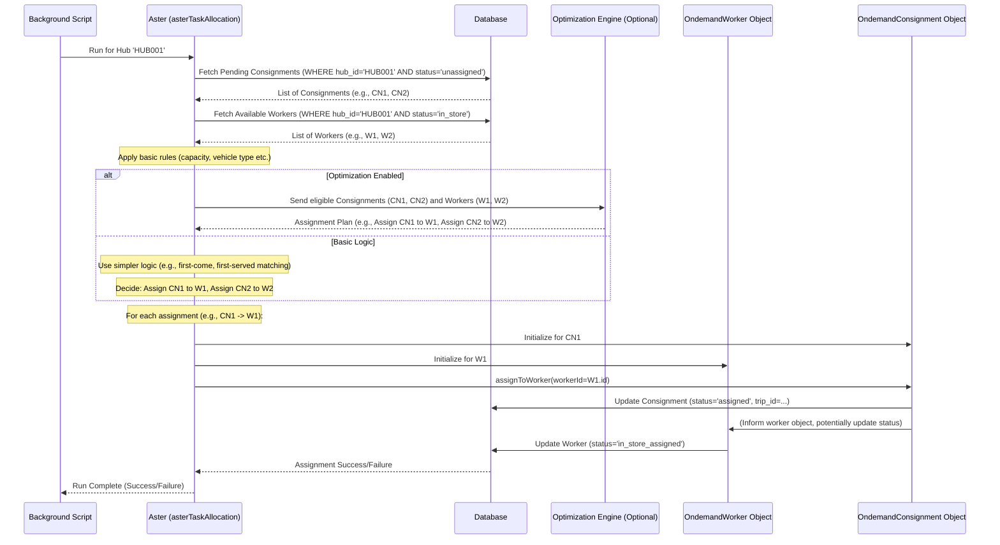

# Chapter 3: Task Allocation Orchestrator (Aster) - The Delivery Matchmaker

Welcome back! In [Chapter 1](01_ondemand_consignment_model.md), we met the `OndemandConsignment`, our digital work ticket for a single delivery. Then, in [Chapter 2](02_ondemand_worker_model.md), we met the `OndemandWorker`, the digital ID card for our delivery drivers.

Now, we have orders waiting and drivers available. How does the system automatically figure out the *best* driver for each order? That's the job of the **Task Allocation Orchestrator**, which we call **Aster**.

## What's the Big Idea? The Delivery Matchmaker

Imagine a busy pizza place on a Friday night. You have several pizzas ready for delivery (`OndemandConsignments`) and a few drivers (`OndemandWorkers`) waiting at the store. Who should take which pizza?

*   Driver A is on a bike, Driver B has a car. Pizza #1 is small, Pizza #2 is huge. Driver A can't take Pizza #2.
*   Pizza #3 needs to go downtown, Pizza #4 is nearby. Driver B is already heading downtown for another order. Maybe Driver B should take Pizza #3 too?
*   Driver C just finished a delivery and is heading back, but they're still 10 minutes away. Should we wait for them for Pizza #4, or give it to Driver A now?

Making these decisions quickly and efficiently is complex! That's where **Aster** comes in.

**Aster is the main coordinator or "brain" for assigning delivery tasks to available workers within a specific area (hub).** Think of it like an **air traffic controller** for deliveries, or maybe a super-smart **matchmaker** connecting orders with the best possible drivers based on a set of rules.

## What Does Aster Do? Step-by-Step

Aster runs periodically (like every minute) for each active hub (e.g., a specific restaurant or warehouse) to see if any tasks need assigning. Here’s a breakdown of its process:

1.  **Gather Information:**
    *   **Find Pending Orders:** Aster looks for all `OndemandConsignments` in the hub that are waiting to be assigned (e.g., status is `unassigned`) or might need reassignment (more on that later).
    *   **Find Available Workers:** Aster finds all `OndemandWorkers` associated with the hub who are ready for work (e.g., status is `in_store`, meaning they are at the hub and available).

2.  **Apply Rules & Check Compatibility:**
    *   For each potential order-worker pair, Aster checks if they are compatible based on various rules (constraints):
        *   **Location:** Is the worker in the right place (e.g., at the hub)?
        *   **Skills/Tags:** Does the order require special handling ("fragile", "requires_car") that the worker possesses? We'll learn more about this in the [Constraint Tag System](04_constraint_tag_system.md).
        *   **Capacity:** Does the worker have enough space (weight/volume) left in their vehicle for this order? Do they already have too many orders?
        *   **Time Windows:** Can the worker realistically pick up and deliver the order within its required time window?
        *   **Worker Status:** Is the worker currently allowed to take new orders (e.g., not on break, not already heading out)?

3.  **Optimize (Optional but Powerful):**
    *   Just finding *compatible* workers isn't always enough. We want the *best* match.
    *   Aster can optionally send the list of eligible orders and available workers to an **external optimization engine**. This engine uses complex algorithms to figure out the most efficient assignments, considering things like:
        *   Minimizing total travel time/distance.
        *   Grouping orders together for a single worker (clubbing - see [Auto-Reassignment & Clubbing Logic](06_auto_reassignment___clubbing_logic.md)).
        *   Prioritizing certain orders or workers (see [Worker Prioritization Strategy](05_worker_prioritization_strategy.md)).
    *   The optimizer returns a plan: "Assign Order A to Worker 1", "Assign Order B and C to Worker 2".

4.  **Make the Assignment:**
    *   Based on the rules or the optimizer's plan, Aster performs the actual assignment.
    *   It uses the methods we saw in previous chapters:
        *   It calls the `assignToWorker` method on the chosen `OndemandConsignment` object.
        *   It calls the `assignOrders` (or similar methods) on the chosen `OndemandWorker` object.
    *   This links the order and worker together in the database and updates their statuses (e.g., order becomes `assigned_for_delivery`, worker becomes `in_store_assigned`).

5.  **Handle Failures (Dropped Tasks):**
    *   What if, after all checks, *no* suitable worker can be found for an order right now?
    *   Aster marks this task as "dropped" for this allocation cycle. It might be picked up in the next cycle when workers become available, or it might require manual intervention.

6.  **Handle Changes (Auto-Reassignment):**
    *   Sometimes, things go wrong *after* an assignment. A worker might get stuck in traffic and be severely delayed.
    *   Aster can detect these situations. If enabled, it might automatically unassign the delayed task and try to reassign it to a different worker who can deliver it faster. This is covered in more detail in [Auto-Reassignment & Clubbing Logic](06_auto_reassignment___clubbing_logic.md).

## Using Aster (Code Examples)

You typically don't call Aster directly for a single order. Instead, it's run automatically for an entire hub. The main function is `asterTaskAllocation`.

**1. Running Aster for a Hub**

Imagine a background script that runs every minute. For each active hub, it calls Aster.

```javascript
// Import the main Aster function
const { asterTaskAllocation } = require('../../../models/internal-api-parts/jfl-parts/aster-task-allocation');
// Assume setup for database connection (extendedModels) and organisation details

const hubIdToProcess = 'HUB001'; // The specific restaurant/warehouse
const organisationId = 'YOUR_ORG_ID';

async function runAllocationForHub() {
    console.log(`Running Aster for Hub: ${hubIdToProcess}`);
    try {
        // Call the main Aster orchestrator function
        const result = await asterTaskAllocation(
            {
                hub_id: hubIdToProcess,
                organisation_id: organisationId,
                // Other parameters might be passed based on configuration
            },
            { /* Request context (req) */ },
            { /* Response context (res) */ }
        );
        console.log(`Aster run complete for ${hubIdToProcess}. Success: ${result.success}`);
        // Aster handles finding orders, workers, and assigning internally.
    } catch (error) {
        console.error(`Aster failed for Hub ${hubIdToProcess}:`, error);
        // Log the error, maybe retry later
    }
}

// Example: Run allocation now
runAllocationForHub();
```

This code simply tells Aster: "Hey, do your magic for Hub `HUB001`". Aster takes care of the rest internally.

**2. Inside Aster: Fetching Data (Conceptual)**

Aster needs to get the lists of pending orders and available workers. It uses SQL queries for this.

```javascript
// --- Inside asterTaskAllocation (Simplified Concept) ---

// 1. Fetch Pending Orders (Consignments) for the Hub
const pendingOrdersQuery = `
    SELECT reference_number, status, weight, /* other details */
    FROM consignment
    WHERE hub_id = $1 AND status = 'unassigned'
    AND eligible_for_auto_allocation = true
    /* ... other conditions like time ... */
`;
// const pendingOrders = await database.query(pendingOrdersQuery, [hubId]);
// Result: List of orders like { reference_number: 'ORDER123', status: 'unassigned', ... }

// 2. Fetch Available Workers for the Hub
const availableWorkersQuery = `
    SELECT worker.id, worker.worker_code, worker.current_status, vehicle.vehicle_category_id
    FROM worker
    JOIN hubworkerrelation ON worker.id = hubworkerrelation.worker_id
    LEFT JOIN vehicle ON worker.vehicle_id = vehicle.id
    WHERE hubworkerrelation.hub_id = $1 AND worker.current_status = 'in_store'
    /* ... other conditions like not on break ... */
`;
// const availableWorkers = await database.query(availableWorkersQuery, [hubId]);
// Result: List of workers like { id: 'w1', worker_code: 'W001', current_status: 'in_store', vehicle_type: 'bike', ... }

console.log(`Found ${pendingOrders.length} orders and ${availableWorkers.length} workers.`);
```

This shows the *idea* of fetching the necessary data. The actual queries (like `getNewConsignmentQuery` and `availabeWorkerQuery` in `aster-task-allocation.js`) are more complex to handle various configurations and edge cases.

**3. Inside Aster: Assigning a Task (Conceptual)**

After the optimizer (or internal logic) decides "Assign ORDER123 to W001", Aster uses the `assignTaskToWorker` helper function (also in `aster-task-allocation.js`). This function, in turn, uses the objects we learned about.

```javascript
// --- Inside assignTaskToWorker (Simplified Concept) ---
// Assume we decided to assign taskList = [{ reference_number: 'ORDER123', type: 'delivery' }]
// to worker = { worker_id: 'w1', worker_code: 'W001' }

const OndemandWorker = require('../../../domain-models/ondemand-handler/ondemand-worker-class/ondemand-worker-class');
const OndemandConsignment = require('../../../domain-models/ondemand-handler/ondemand-consignment-class/ondemand-consignment-class');

async function performAssignment(workerInfo, taskInfo) {
    // Start a database transaction for safety
    // const transaction = await database.beginTransaction();
    try {
        // 1. Load the worker object
        const odw = new OndemandWorker({ /* setup */ });
        await odw.initializeWorkerById({ workerId: workerInfo.worker_id }, { transaction });

        // 2. Load the consignment object
        const odc = new OndemandConsignment({ /* setup */ });
        await odc.initializeConsignmentByReferenceNumber(
             { referenceNumber: taskInfo.reference_number }, { transaction }
        );

        // 3. Perform Validations (Can worker take this task? Is task still available?)
        // await odw.validateWorkerForAssign({}, { transaction });
        // await odw.validateConsignmentForWorker({ requiredConsignment: odc.requiredConsignment }, { transaction });

        // 4. Use the consignment object to assign it to the worker
        await odc.assignToWorker({
            workerId: odw.requiredWorker.id,
            eventTime: new Date(),
            currentTime: new Date(),
            // ... other details ...
        }, { transaction });

        // 5. Update worker status if needed (e.g., from 'in_store' to 'in_store_assigned')
        if (odw.requiredWorker.current_status === 'in_store') {
            await odw.requiredWorker.updateAttributes(
                { current_status: 'in_store_assigned' }, { transaction }
            );
        }

        // If all ok, commit the transaction
        // await database.commit(transaction);
        console.log(`Successfully assigned ${taskInfo.reference_number} to ${workerInfo.worker_code}`);

    } catch (error) {
        // If anything failed, rollback the transaction
        // await database.rollback(transaction);
        console.error(`Failed to assign: ${error.message}`);
        // This task might be marked as "dropped" for this cycle
    }
}

// Example call
// performAssignment({ worker_id: 'w1', worker_code: 'W001' }, { reference_number: 'ORDER123', type: 'delivery' });
```

This simplified flow shows how Aster orchestrates the assignment by using the `OndemandWorker` and `OndemandConsignment` objects to handle the database updates and state changes correctly within a transaction.

## Under the Hood: How Aster Makes Decisions

Let's visualize the core flow when Aster runs for a hub:



**Code Location:**

The primary logic for Aster resides in:
`common/models/internal-api-parts/jfl-parts/aster-task-allocation.js`

Inside this file, you'll find:

*   `asterTaskAllocation`: The main function that orchestrates the entire process for a hub.
*   `getHubsForAsterTaskAllocation`: Finds which hubs have pending work and need Aster to run.
*   `getNewConsignmentQuery` / `availabeWorkerQuery`: (Inside `asterTaskAllocation`) The SQL queries to fetch data.
*   `transformCnToAllocator`: Prepares consignment data into a format the optimizer understands.
*   Helper functions for calling the optimizer (`callOptimizerAPI`) and processing results.
*   `assignTaskToWorker`: Handles the actual assignment logic using `OndemandWorker` and `OndemandConsignment` objects.

Other important related files:

*   `common/domain-models/ondemand-handler/task-allocation/tag-utils.js`: Functions for handling constraint tags during matching (`isWorkerConstraintTagCompatibleWithCn`).
*   `common/domain-models/ondemand-handler/task-allocation/prioritise-workers.js`: Logic for sorting and prioritizing workers before sending them to the optimizer (`prioritiseWorkersList`).
*   `common/models/internal-api-parts/jfl-parts/auto-reassignment-utils.js`: Contains logic for checking if a task needs reassignment.

## Conclusion

You've now learned about **Aster**, the central brain or "matchmaker" of our on-demand delivery system. It's responsible for the complex task of automatically assigning pending delivery orders (`OndemandConsignments`) to the best available `OndemandWorkers` based on a variety of rules, constraints, and potentially optimization logic. It brings together the concepts from Chapters 1 and 2 to make the system operate efficiently.

One of the key ways Aster matches orders and workers is by using **tags** to represent requirements and capabilities. In the next chapter, we'll dive deeper into this powerful feature: [Constraint Tag System](04_constraint_tag_system.md).

---

Generated by [AI Codebase Knowledge Builder](https://github.com/The-Pocket/Tutorial-Codebase-Knowledge)