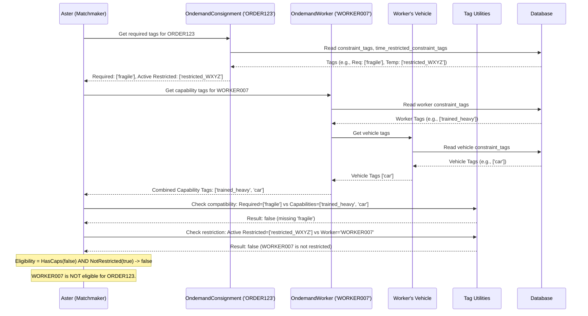

# Chapter 4: Constraint Tag System - Matching Skills to Jobs

Welcome back! In [Chapter 3: Task Allocation Orchestrator (Aster)](03_task_allocation_orchestrator__aster_.md), we saw how Aster acts as the delivery matchmaker, deciding which worker gets which delivery task. But how does Aster know if a worker is actually *capable* of handling a specific task? What if an order needs special equipment, like a freezer bag, or if the worker needs a specific skill?

That's where the **Constraint Tag System** comes in. It's like a system of digital "skill badges" and "job requirements" that helps Aster make smarter assignments.

## What's the Big Idea? The Right Person for the Right Job

Imagine you have different kinds of delivery jobs:
*   Delivering a hot pizza.
*   Delivering fragile glassware.
*   Delivering a heavy piece of furniture.
*   Delivering ice cream that needs to stay frozen.

And you have different kinds of delivery workers:
*   Some use bikes, some use cars.
*   Some have insulated bags, some have refrigerated vehicles.
*   Some are trained to handle heavy items.

How do you make sure the ice cream doesn't get assigned to a worker on a bike with no freezer bag on a hot day?

The **Constraint Tag System** solves this by using simple labels, called **tags**, to mark the requirements of a job and the capabilities of a worker (or their vehicle, or even the hub).

**Think of it like this:**
*   A delivery job (an [Ondemand Consignment Model](01_ondemand_consignment_model.md)) might have a tag like `requires_refrigeration`.
*   A delivery worker (an [Ondemand Worker Model](02_ondemand_worker_model.md)) or their vehicle might have a tag like `has_refrigerated_vehicle`.

Aster, our matchmaker from Chapter 3, uses these tags. It will only assign the ice cream delivery (`requires_refrigeration`) to a worker who has the matching capability (`has_refrigerated_vehicle`).

## Key Concepts: Tags, Tags Everywhere!

1.  **Tags are Simple Labels:** A tag is just a short text label, like `fragile`, `heavy_item`, `needs_car`, `cash_collection`.
2.  **Consignments Have Requirement Tags:** Each delivery order can list the tags it *needs*. For example, an order might require `["fragile", "cash_collection"]`.
3.  **Workers/Vehicles/Hubs Have Capability Tags:** Each worker, their vehicle, or even the hub they work from can have a list of tags representing what they *can* do or what equipment they have. For example, a worker might have `["cash_collection", "has_insulated_bag"]` and their vehicle might have `["car"]`.
4.  **The Matching Rule:** A worker is considered eligible for a consignment *only if* their combined set of tags (from the worker profile + their vehicle + maybe the hub) contains **all** of the tags required by the consignment.
5.  **Time-Restricted Tags (Temporary Constraints):** Sometimes, a requirement is only temporary. Remember the "no_doorbell_after_9pm" example from [Chapter 1](01_ondemand_consignment_model.md)? These are tags attached to a *consignment* that expire after a certain time. The system also handles temporary *restrictions*, like if a worker fails to deliver an order, they might get a temporary tag preventing them from being assigned *that specific order* again for a while (like `restricted_worker_123_for_order_ABC`).

## How Aster Uses Tags (The Matching Process)

When Aster ([Chapter 3](03_task_allocation_orchestrator__aster_.md)) is trying to find a worker for a specific consignment:

1.  **Get Consignment Requirements:** Aster looks at the `OndemandConsignment` and finds its list of required tags (e.g., `["requires_refrigeration"]`). It also checks for any active time-restricted tags.
2.  **Get Worker Capabilities:** For each available `OndemandWorker`, Aster gathers all their capability tags. This includes:
    *   Tags directly on the worker's profile (e.g., `trained_for_cod`).
    *   Tags associated with the worker's vehicle (e.g., `refrigerated_vehicle`).
    *   Maybe even tags from the hub they are associated with.
3.  **Check Compatibility:** Aster uses a function (like `isWorkerConstraintTagCompatibleWithCn`) to compare the consignment's required tags against the worker's combined capability tags.
    *   Does the worker's list `["trained_for_cod", "refrigerated_vehicle", "bike"]` satisfy the requirement `["requires_refrigeration"]`? **Yes.**
    *   Does the worker's list `["trained_for_cod", "has_insulated_bag", "bike"]` satisfy `["requires_refrigeration"]`? **No.**
    *   Does the worker's list `["refrigerated_vehicle", "bike"]` satisfy `["requires_refrigeration", "trained_for_cod"]`? **No** (missing `trained_for_cod`).
4.  **Check Restrictions:** Aster also checks if the consignment has any active time-restricted tags that might *exclude* this specific worker (e.g., `restricted_worker_XYZ_for_this_order`).
5.  **Filter Candidates:** Only workers who pass both the capability check and the restriction check are considered eligible candidates for this specific consignment.

## Using the Tag System (Code Examples)

You usually won't interact with the tag system *directly* in isolation. It's mostly used internally by Aster during the matching process. However, understanding how it works helps you understand Aster's decisions. Here are some conceptual examples:

**1. Getting Tags (Conceptual)**

Imagine functions that retrieve tags. (The actual implementation might involve reading from database fields like `extra_details`).

```javascript
// --- Concept: Getting tags ---
const tagUtils = require('../../../domain-models/ondemand-handler/task-allocation/tag-utils');
const helper = require('../../../../lib/helpfulls'); // For time restriction check

// Assume 'consignmentData' is loaded from the database for ORDER123
const consignmentData = {
    /* ... other fields ... */
    extra_details: {
        constraint_tags: ['fragile', 'cash_collection'],
        time_restricted_constraint_tags: [/* { tag_id: 'no_doorbell', expiry: 1678886400000 } */]
    }
};

// Assume 'workerData' and 'vehicleData' are loaded for WORKER007
const workerData = {
    /* ... other fields ... */
    extra_details: { constraint_tags: ['trained_for_cod'] }
};
const vehicleData = {
    /* ... other fields ... */
    extra_details: { constraint_tags: ['car', 'has_insulated_bag'] }
};

// Get the consignment's required tags
const requiredTags = tagUtils.getConsignmentContraintTags(consignmentData.extra_details);
// requiredTags might be: ['fragile', 'cash_collection']

// Get the worker's capability tags (combining worker + vehicle)
const workerCapabilityTags = tagUtils.getWorkerAndHubConstraintTags(
    workerData.extra_details.constraint_tags, // Worker specific tags
    [], // Hub tags (if any)
    vehicleData.extra_details.constraint_tags, // Vehicle tags
    [] // More worker tags (legacy?)
);
// workerCapabilityTags might be: ['trained_for_cod', 'car', 'has_insulated_bag']

// Get active temporary restriction tags for the consignment
const restrictedTags = helper.getRestrictedConstraintTag(
    consignmentData.extra_details.time_restricted_constraint_tags
);
// restrictedTags might be: ['worker_ABC_cannot_take'] if worker ABC failed before
```

This shows the idea of fetching the different sets of tags associated with the job and the worker.

**2. Checking Compatibility (Conceptual)**

This function is the core of the matching logic.

```javascript
// --- Concept: Checking compatibility ---
const tagUtils = require('../../../domain-models/ondemand-handler/task-allocation/tag-utils');

// From previous example:
const requiredTags = ['fragile', 'cash_collection'];
const workerCapabilityTags = ['trained_for_cod', 'car', 'has_insulated_bag', 'cash_collection']; // Added cash_collection capability
const restrictedTags = []; // No active restrictions for this worker
const workerId = 'WORKER007';

// Check if the worker *has* the required capabilities
const hasCapabilities = tagUtils.isWorkerConstraintTagCompatibleWithCn(
    workerCapabilityTags,
    requiredTags,
    { /* ondemandSettings */ } // Configuration options might influence this
);
// hasCapabilities would be false initially (missing 'fragile')
// If requiredTags was just ['cash_collection'], hasCapabilities would be true.

// Check if the worker is specifically restricted *from* this task
const isRestricted = !tagUtils.isCnRestrictedConstraintTagsCompatibleWithWorker(
    restrictedTags, // The list of currently restricted worker IDs for this task
    workerId
);
// isRestricted would be false here.

// Final decision: Worker is eligible only if they have capabilities AND are not restricted
const isEligible = hasCapabilities && !isRestricted;

console.log(`Is ${workerId} eligible? ${isEligible}`);
```

This function (`isWorkerConstraintTagCompatibleWithCn`) simply checks if the `workerCapabilityTags` array contains every item present in the `requiredTags` array. The `isCnRestrictedConstraintTagsCompatibleWithWorker` checks if the `workerId` is present in the `restrictedTags` list.

**3. Adding a Temporary Restriction Tag**

We saw this in [Chapter 1](01_ondemand_consignment_model.md), but let's look again with the tag system in mind. This function adds a temporary tag *to a consignment*.

```javascript
// From: common/models/internal-api-parts/jfl-parts/allocation-cn-utils.js
const { updateTimeRestrictedConstraintTags } = require('./allocation-cn-utils');

// Assume setup: organisationId, extendedModels (DB tools)

const orderReferenceNumber = 'ORDER789';
// Let's say WORKER007 just failed this delivery attempt.
// We want to prevent WORKER007 from being assigned this order again for 1 hour.
const workerToRestrict = 'WORKER007';
const restrictionDurationSeconds = 3600; // 1 hour

async function addTemporaryRestriction() {
    try {
        await updateTimeRestrictedConstraintTags(
            organisationId,
            extendedModels,
            {
                referenceNumber: orderReferenceNumber,
                consignmentRejectedDuration: restrictionDurationSeconds,
                timeRestrictedTags: [workerToRestrict], // The tag *is* the worker ID
                eventTime: new Date()
            },
            { source: 'tutorial', creatorType: 'script' }
        );
        console.log(`Added temporary restriction for ${workerToRestrict} on ${orderReferenceNumber}.`);
        // Now, if Aster checks this order against WORKER007 within the next hour,
        // isCnRestrictedConstraintTagsCompatibleWithWorker will return false.

    } catch (error) {
        console.error("Failed to add temporary restriction:", error);
    }
}

// addTemporaryRestriction();
```

This uses the `OndemandConsignment` object internally to update the `time_restricted_constraint_tags` field in the database for that specific order.

## Under the Hood: How Compatibility is Checked

Let's visualize how Aster uses the tag system when evaluating a worker for a consignment:



**Code Locations:**

*   **Tag Logic:** `common/domain-models/ondemand-handler/task-allocation/tag-utils.js`
    *   `getConsignmentContraintTags`: Extracts required tags from consignment data.
    *   `getWorkerAndHubConstraintTags`: Combines tags from worker, vehicle, hub.
    *   `isWorkerConstraintTagCompatibleWithCn`: Performs the core capability check (does worker have all required tags?).
    *   `isCnRestrictedConstraintTagsCompatibleWithWorker`: Checks if a worker is specifically restricted by a temporary tag.
*   **Temporary Tag Handling:**
    *   `common/lib/helpfulls.js` contains `getRestrictedConstraintTag` which likely filters expired tags from a list.
    *   `common/models/internal-api-parts/jfl-parts/allocation-cn-utils.js` contains `updateTimeRestrictedConstraintTags` for adding temporary tags to consignments.
*   **Usage within Aster:** `common/models/internal-api-parts/jfl-parts/aster-task-allocation.js` uses these `tagUtils` functions when filtering workers and preparing data for the optimizer.

```javascript
// Inside tag-utils.js (Simplified Concept)

function getConsignmentContraintTags(consignmentDetails) {
    // Extracts tags from consignment.extra_details.constraint_tags
    return consignmentDetails.constraint_tags || [];
}

function getWorkerAndHubConstraintTags(workerDetails, hubIds, vehicleTags, workerTags) {
    // Simply combines all provided tag arrays into one unique list
    const combined = [];
    if (Array.isArray(workerDetails)) combined.push(...workerDetails);
    // ... push other tag sources ...
    return [...new Set(combined)]; // Return unique tags
}

function isWorkerConstraintTagCompatibleWithCn(workerCapabilityTags, consignmentRequiredTags, settings) {
    if (!Array.isArray(consignmentRequiredTags) || consignmentRequiredTags.length === 0) {
        return true; // Consignment requires nothing, so compatible.
    }
    if (!Array.isArray(workerCapabilityTags) || workerCapabilityTags.length === 0) {
        return false; // Consignment requires tags, but worker has none.
    }
    // Check if EVERY required tag is present in the worker's capabilities
    return consignmentRequiredTags.every(reqTag => workerCapabilityTags.includes(reqTag));
}

function isCnRestrictedConstraintTagsCompatibleWithWorker(activeRestrictedTags, workerId) {
    if (!Array.isArray(activeRestrictedTags) || !activeRestrictedTags.length) {
        return true; // No restrictions active.
    }
    // Check if the worker's ID is in the list of restricted IDs
    return !activeRestrictedTags.includes(workerId);
}
```

This simplified view shows the core logic: getting lists of tags and comparing them based on the rules.

## Conclusion

The Constraint Tag System provides a simple yet powerful way to ensure that delivery tasks are assigned only to workers who meet the necessary requirements. By using tags for capabilities (worker/vehicle) and requirements (consignment), Aster ([Chapter 3](03_task_allocation_orchestrator__aster_.md)) can intelligently filter potential candidates, leading to more successful deliveries. It even handles temporary restrictions gracefully.

Tags help determine *if* a worker *can* do a job. But what if multiple workers are eligible? How does Aster decide which one is the *best* choice? That involves ranking and prioritization, which we'll explore in the next chapter: [Worker Prioritization Strategy](05_worker_prioritization_strategy.md).

---

Generated by [AI Codebase Knowledge Builder](https://github.com/The-Pocket/Tutorial-Codebase-Knowledge)