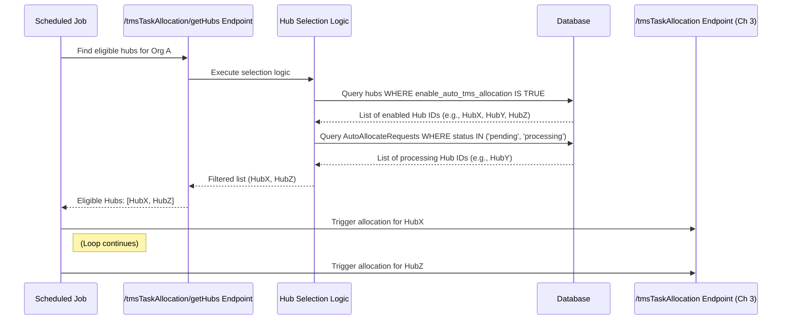

# Chapter 4: Hub Selection Logic

Welcome back! In [Chapter 3: Task Allocation Endpoint](03_task_allocation_endpoint.md), we learned how external systems trigger the task assignment process for a *specific* hub by calling endpoints like `/tmsTaskAllocation` or `/ondemandTaskAllocation`.

But how does the system decide *which* hubs need their tasks allocated in the first place? Imagine a large delivery network with hundreds of local distribution centers (hubs). It wouldn't be efficient to constantly try and allocate tasks for every single hub, especially if some are closed, have no pending orders, or aren't even set up for automatic assignments.

This chapter explores the **Hub Selection Logic**: the process of identifying which operational centers (hubs) are actually ready and eligible to have tasks allocated *before* we even start the main assignment process for them.

## What's the Big Idea?

Think of a regional manager overseeing many local delivery centers. Before sending out daily instructions (like triggering the task allocation), they wouldn't just blast the same message to everyone. They'd first check:

1.  **Is this center currently operational and active?**
2.  **Is it enabled for the automated assignment system?** (Maybe some centers handle assignments manually).
3.  **Does it actually have any orders waiting to be dispatched right now?**

This pre-check ensures the manager only focuses their attention (and the system's resources) on the centers that actually need processing.

"Hub Selection Logic" in ProjectX works similarly. It's a preliminary step, often performed by a scheduler or a dedicated endpoint, to **create a list of hubs that are valid targets for the *next* round of task allocation.**

## Why Select Hubs First?

Instead of blindly trying to allocate tasks for every hub using the [Task Allocation Endpoint](03_task_allocation_endpoint.md), selecting hubs beforehand offers several benefits:

*   **Efficiency:** Avoids wasting resources trying to process hubs with no work or that aren't configured for automatic allocation.
*   **Focus:** Allows the system to concentrate on hubs that genuinely need attention.
*   **Control:** Provides a way to manage which hubs participate in automated processes based on configuration or operational status.
*   **Concurrency Control:** Prevents multiple allocation processes from running for the same hub simultaneously.

## How Are Hubs Selected?

The system typically queries the database to find hubs that meet specific criteria. Common checks include:

1.  **Configuration Flags:** Looking for settings directly on the hub's record. A very common flag is `enable_auto_tms_allocation` (often stored within an `extra_details` JSON field in the `hub` table). If this flag is `TRUE`, the hub is considered eligible for automatic TMS (Transport Management System) allocation.
2.  **Pending Consignments:** Checking if the hub has consignments (tasks) that meet certain conditions:
    *   **Status:** Are there tasks with statuses like 'reachedathub' or 'unassigned'?
    *   **Time:** Were these tasks received within a relevant timeframe (e.g., today's orders before the allocation cutoff time)?
3.  **Operational Status:** Is the hub marked as active or operational in the system?
4.  **Allocation Process Check:** Is an allocation process already running for this hub? We usually want to avoid starting a new one if a previous one is still processing. This is often checked by looking at a dedicated table like `AutoAllocateRequests` for pending or processing entries for the hub.

## Example Use Case: Finding Hubs for TMS Allocation

Let's imagine a scheduled job runs every few minutes. Its goal is to find all hubs that should have their regular TMS tasks allocated via the `/tmsTaskAllocation` endpoint.

Here's how the Hub Selection Logic might work in this scenario:

1.  **Query for Enabled Hubs:** The system asks the database for all hubs belonging to the company (`organisation_id`) that have the `enable_auto_tms_allocation` flag set to `TRUE`.
2.  **Filter Out Already Processing Hubs:** The system checks the `AutoAllocateRequests` table. If a hub found in step 1 already has an entry with status 'pending' or 'processing' (and it hasn't timed out), it's temporarily skipped to avoid conflicts.
3.  **Return the List:** The system gets a final list of `hub_id`s that are enabled and not currently being processed.
4.  **Trigger Allocation:** The scheduled job then iterates through this list, calling the `/tmsTaskAllocation` endpoint (from [Chapter 3: Task Allocation Endpoint](03_task_allocation_endpoint.md)) for each `hub_id`.

This ensures that the allocation endpoint is only called for hubs that are configured for it and ready for a new allocation run.

## Under the Hood: A Glimpse Inside

How is this selection performed in the code? Often, there's a specific API endpoint designed just for this purpose, like `/tmsTaskAllocation/getHubs` found in `tms-task-allocation.js`.

**1. Conceptual Flow:**



This diagram shows the scheduler first calling `getHubs` to get the list, and *then* calling the main allocation endpoint for each eligible hub.

**2. Simplified Code Examples:**

Let's look at simplified snippets inspired by `getHubsForTmsTaskAllocation` in `tms-task-allocation.js`.

**a) Querying Enabled Hubs:**

The system needs to ask the database for hubs that are switched on for auto-allocation.

```sql
-- Simplified SQL to find hubs enabled for TMS allocation
SELECT
    hub.id AS hub_id,
    hub.code
FROM
    hub
WHERE
    hub.organisation_id = 'your_company_id'  -- For the correct company
    -- Check the JSON flag within extra_details
    AND (hub.extra_details->>'enable_auto_tms_allocation')::BOOLEAN IS TRUE;
```

*   This query selects the `id` and `code` from the `hub` table.
*   It filters by `organisation_id`.
*   The key part is `(hub.extra_details->>'enable_auto_tms_allocation')::BOOLEAN IS TRUE`. It accesses the `enable_auto_tms_allocation` value inside the `extra_details` JSON field and checks if it's true.

**b) Filtering Processing Hubs (Conceptual JavaScript):**

After getting the list of enabled hubs, the code often checks for hubs already being processed.

```javascript
// Simplified concept from getHubsForTmsTaskAllocation

async function getEligibleHubs(organisationId, extendedModels) {
  // 1. Query hubs enabled for auto TMS allocation (using SQL like above)
  const hubQuery = `
    SELECT DISTINCT hub.id, hub.code
    FROM hub
    WHERE hub.organisation_id = $1
      AND (hub.extra_details->>'enable_auto_tms_allocation')::BOOLEAN IS TRUE
  `;
  const enabledHubsResult = await helper.executeQueryAsync(extendedModels.Hub, hubQuery, [organisationId]);
  // Result might be: [{ id: 'hubX', code: 'HX' }, { id: 'hubY', code: 'HY' }, { id: 'hubZ', code: 'HZ' }]

  if (!enabledHubsResult || !enabledHubsResult.length) {
    return []; // No enabled hubs found
  }

  const enabledHubIds = enabledHubsResult.map(hub => hub.id); // ['hubX', 'hubY', 'hubZ']

  // 2. Find hubs with currently pending or processing allocation requests
  const existingRequests = await extendedModels.AutoAllocateRequests.find({
    where: {
      organisationId: organisationId,
      status: { inq: ['pending', 'processing'] }, // Check for these statuses
      hubId: { inq: enabledHubIds },             // Only check our enabled hubs
    }
  });
  // Result might be: [{ hubId: 'hubY', updatedAt: '...', status: 'processing' }]

  // 3. Filter out hubs that are currently processing (and haven't timed out)
  const processingHubIds = new Set();
  const currentTime = new Date();
  for (const request of existingRequests) {
    const lastUpdateTime = new Date(request.updatedAt);
    const timeDiffMinutes = (currentTime - lastUpdateTime) / (1000 * 60);

    // If the request is recent (e.g., < 20 minutes old), consider the hub as busy
    if (timeDiffMinutes < 20) {
      processingHubIds.add(request.hubId); // Add 'hubY' to the set
    } else {
      // Request is old/stale, can be ignored or marked as failed later
    }
  }

  // 4. Return hubs that are enabled AND not currently processing
  const hubsToRunAllocation = enabledHubsResult.filter(hub => !processingHubIds.has(hub.id));
  // Result: [{ id: 'hubX', code: 'HX' }, { id: 'hubZ', code: 'HZ' }]

  return hubsToRunAllocation;
}
```

*   The code first fetches all hubs with the `enable_auto_tms_allocation` flag.
*   It then queries the `AutoAllocateRequests` table to find any requests for those hubs that are 'pending' or 'processing'.
*   It checks the `updatedAt` timestamp of these requests. If a request is recent, the corresponding `hubId` is added to `processingHubIds`.
*   Finally, it filters the initial list of `enabledHubsResult`, keeping only those whose IDs are *not* in the `processingHubIds` set.
*   This final list contains the hubs ready for a new allocation run.

## Conclusion

Excellent! You've learned about **Hub Selection Logic**, the important preliminary step where ProjectX determines *which* hubs are eligible for task allocation *before* diving into the main assignment process.

You now understand:
*   **Why** we select hubs: For efficiency, focus, and control.
*   **What** criteria are used: Configuration flags (like `enable_auto_tms_allocation`), pending tasks, and checks for ongoing processes.
*   **How** it works: Often via a dedicated endpoint (`/getHubs`) that queries the database and filters hubs based on these criteria.

Now that the system has identified an eligible hub (via Hub Selection Logic), received the trigger (via the [Task Allocation Endpoint](03_task_allocation_endpoint.md)), gathered the tasks ([Consignment Data Handling](01_consignment_data_handling.md)), and found the available workers ([Worker Data Handling](02_worker_data_handling.md)), what's next? It's time to execute the core logic that actually decides *how* to assign those tasks to those workers.

Let's move on to explore how different assignment strategies are executed!

**Next:** [Chapter 5: Allocation Strategy Execution](05_allocation_strategy_execution.md)

---

Generated by [AI Codebase Knowledge Builder](https://github.com/The-Pocket/Tutorial-Codebase-Knowledge)