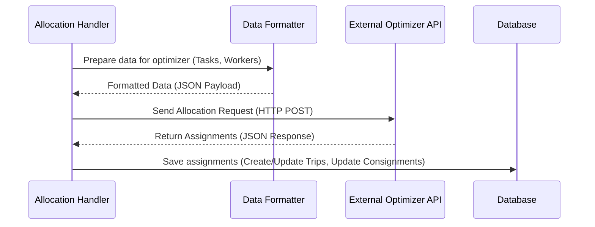
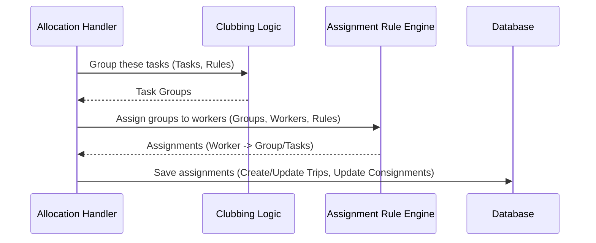
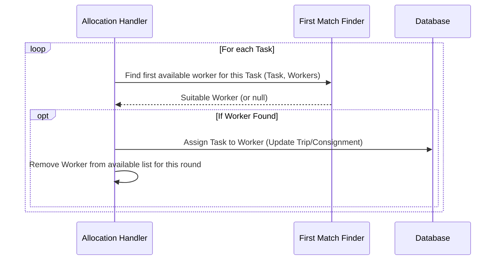
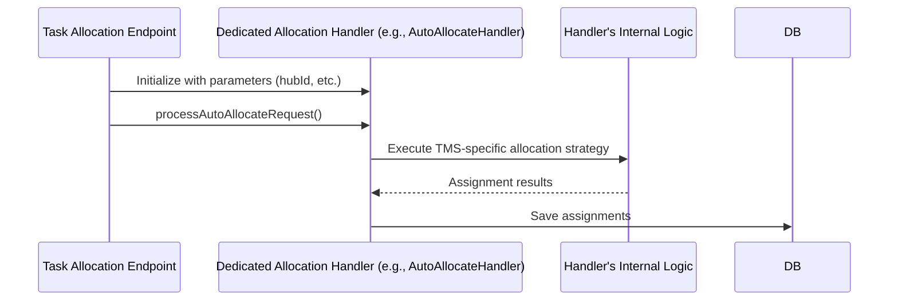

# Chapter 5: Allocation Strategy Execution

Welcome back! In the previous chapters, we learned how ProjectX gathers tasks ([Chapter 1: Consignment Data Handling](01_consignment_data_handling.md)), finds available workers ([Chapter 2: Worker Data Handling](02_worker_data_handling.md)), receives the command to start ([Chapter 3: Task Allocation Endpoint](03_task_allocation_endpoint.md)), and identifies the right hub ([Chapter 4: Hub Selection Logic](04_hub_selection_logic.md)).

We now have everything we need:
*   A list of ready-to-go delivery tasks (consignments).
*   A list of available workers (drivers/riders) with their details.
*   A specific hub that needs these tasks assigned.

But how does the system actually *decide* which worker should get which task? This chapter dives into the core decision-making process: **Allocation Strategy Execution**.

## What's the Big Idea?

Imagine our dispatcher again. They have the delivery slips neatly stacked and know which drivers are ready. Now comes the crucial part: pairing those slips with the drivers. How do they decide?

*   Do they use fancy routing software to plan the most efficient multi-stop routes for everyone?
*   Do they follow simple company rules, like "All Zone A orders go to Driver 1, Zone B orders to Driver 2"?
*   Do they just hand out slips one by one, first-come, first-served?
*   Do they group nearby deliveries together before assigning them?

There's no single "right" way – it depends on the situation!

"Allocation Strategy Execution" in ProjectX is exactly this decision-making process. It's the brain of the operation where the system applies a specific **strategy** (a method or set of rules) to match the eligible consignments with the most suitable workers or create delivery trips. The result is the actual assignment of tasks.

## Different Strategies for Different Needs

ProjectX is flexible and supports various ways to assign tasks because different delivery scenarios require different approaches. Here are the main types of strategies you'll encounter:

1.  **External Optimization Engines (e.g., Aster, Ondemand):**
    *   **Analogy:** Using sophisticated GPS routing software (like Google Maps planning a complex multi-stop trip, but for many drivers at once).
    *   **How it works:** The system bundles up all the task details (locations, time windows, sizes) and worker details (availability, capacity, start/end points) and sends them to a powerful external service (often via an API call). This service uses complex algorithms to figure out the *optimal* way to group tasks into trips and assign them to workers, aiming for goals like minimizing travel time or distance. It then sends the results (the assignments) back to ProjectX.
    *   **Used for:** Complex scenarios needing high efficiency, like assigning many deliveries across a city to a fleet of drivers (often seen in `ondemand-task-allocation.js` or `aster-task-allocation.js`).

2.  **Rule-Based Clubbing and Assignment (e.g., JFL):**
    *   **Analogy:** Following a specific company playbook or a dispatcher's experienced-based rules.
    *   **How it works:** The system applies a set of predefined rules coded directly into ProjectX. This might involve:
        *   **Clubbing:** Grouping orders together based on criteria like destination area, delivery time window, or specific tags (`constraint_tags`).
        *   **Assignment:** Assigning these groups (or individual tasks) to workers based on rules like worker capacity, vehicle type, skills, or current workload.
    *   **Used for:** Scenarios where assignments follow consistent business logic, like fast-food delivery where orders going to the same area are often grouped (often seen in `jfl-task-allocation.js`).

3.  **Simpler Sequential Assignment (e.g., Udaan):**
    *   **Analogy:** The dispatcher takes the first delivery slip from the pile and gives it to the first available driver, then repeats.
    *   **How it works:** The system processes tasks one by one in a specific order (e.g., oldest first). For each task, it finds the first available worker who meets the basic requirements (like capacity and skills) and assigns it immediately.
    *   **Used for:** Simpler cases, express deliveries, or scenarios where complex optimization isn't needed (often seen in `udaan-task-allocation.js`).

4.  **Integration with a Dedicated Allocation Handler (e.g., TMS):**
    *   **Analogy:** Handing off the assignment job to a specialized department or a separate system that handles only that function.
    *   **How it works:** ProjectX gathers the tasks and workers, but then passes this information to another internal module or system (like the `AutoAllocateHandler` in the TMS context) which contains its own specific allocation logic. ProjectX essentially delegates the decision-making.
    *   **Used for:** Integrating with larger Transport Management Systems where allocation might involve pre-planned routes or existing trips (often seen in `tms-task-allocation.js`).

The specific strategy used is often determined by the type of allocation request (e.g., the endpoint called in [Chapter 3: Task Allocation Endpoint](03_task_allocation_endpoint.md)) and system configuration (see [Chapter 8: Configuration-Driven Behavior](08_configuration_driven_behavior.md)).

## How It Works: An Example (External Optimizer)

Let's walk through a simplified example using an **External Optimization Engine**, a common strategy for complex assignments (like in `ondemand-task-allocation.js` or `aster-task-allocation.js`).

**Inputs:**

1.  **Prepared Tasks (from Chapter 1):**
    ```json
    [
      { "task_id": "TASK_001", "pickup": {...}, "delivery": {...}, "time_window": "14:00-15:00", "size": 5 },
      { "task_id": "TASK_002", "pickup": {...}, "delivery": {...}, "time_window": "14:30-15:30", "size": 3 },
      { "task_id": "TASK_003", "pickup": {...}, "delivery": {...}, "time_window": "15:00-16:00", "size": 8 }
    ]
    ```
2.  **Prepared Workers (from Chapter 2):**
    ```json
    [
      { "worker_id": "WKR_A", "status": "in_store", "capacity": 10, "vehicle": "SCOOTER", "availability": "13:00-18:00" },
      { "worker_id": "WKR_B", "status": "in_store", "capacity": 15, "vehicle": "VAN", "availability": "13:00-18:00" }
    ]
    ```

**Execution Steps (Simplified):**

1.  **Format Data:** The system takes the task and worker lists and converts them into the specific format required by the external optimizer's API. This often involves mapping field names and structuring the data correctly.
2.  **Send Request:** ProjectX makes an HTTP POST request to the optimizer's URL (e.g., `app.mApplicationConfig.AUTO_ALLOCATE_URL`), sending the formatted task and worker data in the request body.
3.  **Wait for Response:** The external optimizer runs its complex calculations.
4.  **Receive Results:** The optimizer sends back a response containing the assignments.

**Output (Assignments):**

The optimizer might return something like this, indicating how tasks are grouped into trips and assigned to workers:

```json
{
  "success": true,
  "data": [
    {
      "vehicle": { "worker_id": "WKR_A", "worker_code": "RiderA" },
      "task_list": [
        { "reference_number": "TASK_001", "sequence": 1, /* other details */ },
        { "reference_number": "TASK_002", "sequence": 2, /* other details */ }
      ],
      "trip_id": "TRIP_123"
    },
    {
      "vehicle": { "worker_id": "WKR_B", "worker_code": "DriverB" },
      "task_list": [
        { "reference_number": "TASK_003", "sequence": 1, /* other details */ }
      ],
      "trip_id": "TRIP_124"
    }
  ],
  "dropped_tasks": [] // List of tasks that couldn't be assigned
}
```

This output tells ProjectX:
*   Assign tasks TASK_001 and TASK_002 to Worker A (in that order) as part of Trip 123.
*   Assign task TASK_003 to Worker B as part of Trip 124.

ProjectX then uses this information to update the status of the consignments and create/update the corresponding trips in its own database.

## Under the Hood: Sequence and Code Snippets

Let's look at how different strategies might be implemented.

**1. External Optimizer (e.g., Ondemand/Aster)**



*   The `Allocation Handler` (triggered by the endpoint) gets the task and worker data.
*   It uses a `Data Formatter` to prepare the payload.
*   It calls the `External Optimizer API`.
*   It receives the assignment plan.
*   It updates the ProjectX `Database` with the results.

**Simplified Code Snippet (Calling Optimizer):** (Inspired by `ondemand-task-allocation.js` / `aster-task-allocation.js`)

```javascript
// Inside the allocation logic...

// Assume 'tasksForAllocator' and 'workersForAllocator' are prepared lists
const allocatorParams = {
  organisation_id: organisationId,
  task_list: tasksForAllocator,   // Prepared tasks
  vehicles: workersForAllocator, // Prepared workers
  start_depot: [[hubLat, hubLng]], // Hub location
  end_depot: [[hubLat, hubLng]],
  // ... other configuration like speed, constraints, planning type ...
  planning_type: 'add_to_existing', // Or 'create_new'
};

try {
  // Make the API call to the external optimizer
  const response = await requestPromiseDecorator({
      method: 'POST',
      url: app.mApplicationConfig.AUTO_ALLOCATE_URL, // The optimizer endpoint
      headers: {
          'api-key': app.mApplicationConfig.AUTO_ALLOCATE_API_KEY,
          'content-type': 'application/json',
          'organisation-id': organisationId
      },
      body: allocatorParams, // Send the prepared data
      json: true,
      resolveWithFullResponse: true
  });

  // Process the response from the optimizer
  const assignmentResults = response.body.data || [];
  const droppedTasks = response.body.dropped_tasks || [];

  // --- Now, process 'assignmentResults' to create trips in ProjectX ---
  // (Logic to loop through results and update DB omitted for simplicity)
  // Example: await createTripsFromOptimizerResult(assignmentResults);

} catch (error) {
  console.error("Optimizer call failed:", error);
  // Handle error, maybe mark tasks as unassigned
}
```

*   This code prepares `allocatorParams` with task and worker data.
*   It uses `requestPromiseDecorator` (a library for making HTTP requests) to call the `AUTO_ALLOCATE_URL`.
*   It sends the `allocatorParams` as the request body.
*   It processes the `response` to get the assignments (`assignmentResults`).

**2. Rule-Based Clubbing/Assignment (e.g., JFL)**



**Simplified Code Snippet (Rule-Based):** (Conceptual, inspired by `jfl-task-allocation.js`)

```javascript
// Inside the allocation logic...

// Assume 'newConsignments' and 'hubWorkerResult' are prepared lists

// 1. Filter/Group consignments (Example: Club nearby orders)
const taskGroups = clubbingUtils.groupNearbyConsignments(
  newConsignments,
  ondemandSettings.threshold_distance_for_order_clubbing,
  requiredHub // Hub location needed for distance calculation
);

// 2. Assign groups based on rules
for (const group of taskGroups) {
  let assignedWorker = null;
  for (const worker of hubWorkerResult) {
    // Rule 1: Check if worker has capacity for the group
    if (worker.current_load + group.size <= worker.capacity) {
       // Rule 2: Check if worker meets constraint tags (e.g., 'COD_Handling')
       if (tagUtils.isWorkerCompatible(worker.tags, group.required_tags)) {
         assignedWorker = worker;
         break; // Found a suitable worker
       }
    }
  }

  if (assignedWorker) {
    // Assign the group to this worker
    console.log(`Assigning group ${group.id} to worker ${assignedWorker.worker_code}`);
    // --- Update DB: Create trip, assign tasks ---
    // await assignGroupToWorker(group, assignedWorker);
    // Remove worker from available list (or update load)
    // hubWorkerResult = hubWorkerResult.filter(w => w.worker_id !== assignedWorker.worker_id);
  } else {
    console.log(`No suitable worker found for group ${group.id}`);
    // Mark tasks as unassigned or handle differently
  }
}
```

*   This conceptual code first calls a `clubbingUtils` function to group tasks.
*   It then loops through each `group`.
*   Inside the loop, it iterates through available `hubWorkerResult`.
*   It applies rules (capacity check, tag compatibility) using `if` conditions.
*   If a suitable worker is found, it assigns the group (details omitted).

**3. Sequential Assignment (e.g., Udaan)**



**Simplified Code Snippet (Sequential):** (Conceptual, inspired by `udaan-task-allocation.js`)

```javascript
// Inside the allocation logic...

// Assume 'unassignedConsignmentTripResult' and 'eligibleInstoreWorkers' are lists

for (const task of unassignedConsignmentTripResult) {
  let assigned = false;
  for (let i = 0; i < eligibleInstoreWorkers.length; i++) {
    const worker = eligibleInstoreWorkers[i];

    // Basic checks (simplified)
    const isCompatible = checkCompatibility(worker, task); // Function checks capacity, tags etc.

    if (isCompatible) {
      console.log(`Assigning task ${task.reference_number} sequentially to worker ${worker.worker_code}`);
      // --- Update DB: Assign task to worker ---
      // await assignTaskToWorker(task, worker);

      // Remove worker from pool for this allocation run
      eligibleInstoreWorkers.splice(i, 1);
      assigned = true;
      break; // Move to the next task
    }
  }

  if (!assigned) {
    console.log(`No worker found sequentially for task ${task.reference_number}`);
  }
}
```

*   This code loops through each `task`.
*   For each task, it loops through `eligibleInstoreWorkers`.
*   It calls `checkCompatibility` (details hidden) to see if the worker can handle the task.
*   If compatible, it assigns the task and removes the worker from the list for the current run.

**4. Dedicated Handler (e.g., TMS)**



**Simplified Code Snippet (Delegation):** (Inspired by `tms-task-allocation.js`)

```javascript
// Inside the '/tmsTaskAllocation' endpoint function...

// 1. Prepare parameters based on the request and configuration
const paramsForAutoAllocateConstructor = await validateAutoAllocatedRequest(
  organisationId, extendedModels, paramsToSend
);

// 2. Create an instance of the dedicated handler
const autoAllocateHandler = new AutoAllocateHandler(paramsForAutoAllocateConstructor);

// 3. Mark the request as pending (for tracking)
await autoAllocateHandler.markAutoAllocateRequestAsPending();

// 4. **Delegate the actual work** to the handler's processing method
//    This function will run in the background and perform the TMS-specific allocation.
autoAllocateHandler.processAutoAllocateRequest();

// 5. Respond quickly to the caller
return { success: true, message: "TMS Allocation process started." };
```

*   This code prepares parameters (`paramsForAutoAllocateConstructor`).
*   It creates an `AutoAllocateHandler` instance.
*   Crucially, it calls `autoAllocateHandler.processAutoAllocateRequest()`. This function contains all the specific logic for TMS allocation (fetching data, applying rules, assigning to existing trips, etc.). The endpoint itself doesn't perform the assignment, it just kicks off the handler.

## Conclusion

Fantastic! You've now explored the very heart of ProjectX's assignment system: **Allocation Strategy Execution**. This is where the theoretical matching becomes reality.

You've learned:
*   **Why** different strategies exist: To handle diverse delivery needs efficiently.
*   **What** the main strategies are: External Optimizers, Rule-Based, Sequential, and Dedicated Handlers.
*   **How** they work conceptually: By applying algorithms, rules, or simple sequences to pair tasks and workers.
*   **How** they are implemented: Through API calls, internal rule engines, loops, or delegation to specialized handlers.

A critical part of many of these strategies, especially rule-based and optimizer-based ones, involves checking specific requirements or limitations – like "Does this package require refrigeration?" or "Can this worker handle cash payments?". These are known as **constraints**.

In the next chapter, we'll dive into how ProjectX handles these specific requirements to ensure tasks are only assigned to workers who can actually fulfill them.

**Next:** [Chapter 6: Constraint Matching Logic](06_constraint_matching_logic.md)

---

Generated by [AI Codebase Knowledge Builder](https://github.com/The-Pocket/Tutorial-Codebase-Knowledge)