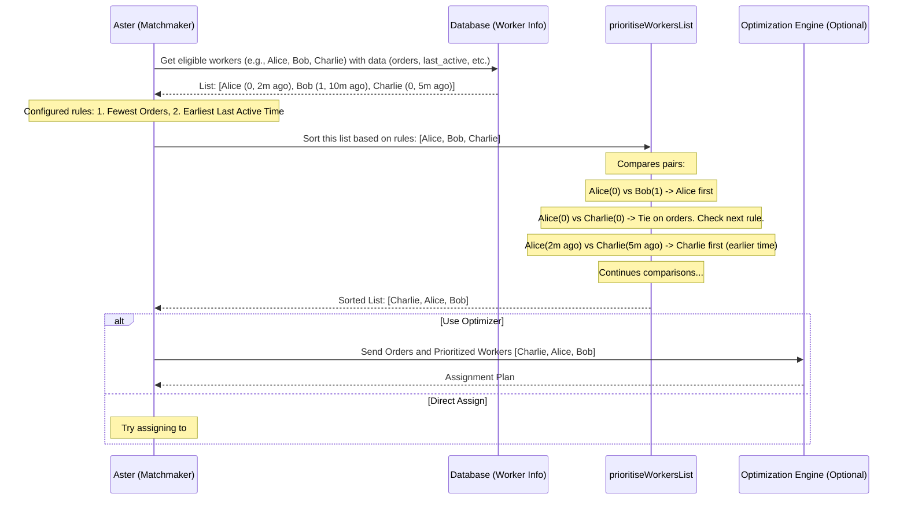

# Chapter 5: Worker Prioritization Strategy - Choosing the Best Player

Welcome back! In [Chapter 4: Constraint Tag System](04_constraint_tag_system.md), we learned how `projectx` uses tags to figure out *which* delivery workers are *capable* of handling a specific delivery task. It's like checking IDs at the door – only those who meet the requirements get through.

But what happens when *multiple* workers are perfectly capable? Imagine two qualified drivers are waiting. Who should get the next delivery? We need a way to choose the *best* or *most preferred* worker among the eligible ones.

That's where the **Worker Prioritization Strategy** comes in.

## What's the Big Idea? Making the Lineup Fair and Smart

Think back to our pizza place example. Let's say we have a new pizza order ready (`OndemandConsignment`) that needs delivering nearby.

Two workers are available at the store and meet all the requirements (checked using the [Constraint Tag System](04_constraint_tag_system.md)):
*   **Alice:** Using a bike, currently has **0** other orders, just logged in 2 minutes ago (`in_store` status).
*   **Bob:** Using a car, currently has **1** other order, returned from his last delivery 10 minutes ago (`in_store` status).

Both Alice and Bob *can* do the job. But who *should* do it? Maybe we want to:
*   Give it to Alice because she has fewer orders, balancing the workload.
*   Give it to Alice because she's been idle longer.
*   Give it to Bob because he has a car (maybe it might rain?).

The **Worker Prioritization Strategy** is like defining the rules for creating an **ordered lineup** or a **ranking** of all the eligible workers. Based on configured rules, it takes the list of suitable workers (like Alice and Bob) and sorts them from most preferred to least preferred.

This ensures that the [Task Allocation Orchestrator (Aster)](03_task_allocation_orchestrator__aster_.md), our delivery matchmaker, considers the "best" worker first when deciding who gets the assignment.

## How Do We Rank Workers? The Rules of the Lineup

We can configure `projectx` to rank workers based on various criteria. Here are some common ones:

1.  **Fewest Current Orders:** Workers with fewer active deliveries are often preferred. This helps distribute work evenly. (In our example, Alice (0) would likely rank higher than Bob (1)).
2.  **Time Since Last Activity:** Workers who have been idle longer might be prioritized. This could be based on when they last completed a task, returned to the hub, or logged in. (Alice (idle 2 mins) might rank higher than Bob (idle 10 mins), or vice-versa depending on the exact rule - e.g., "most recently active" vs "longest idle").
3.  **Vehicle Type Preference:** Sometimes, certain vehicle types are preferred based on the order or general strategy (e.g., bikes for short trips, cars for larger orders or bad weather). The system can be configured to rank workers with specific vehicle types higher.
4.  **Worker Status Priority:** You might want to prioritize workers with a specific status. For example, workers already `in_store` might be preferred over those `returning_to_store` (who aren't quite ready yet).
5.  **Past Performance (Less Common for Basic Setup):** While possible, ranking based on metrics like average delivery time or customer ratings is usually a more advanced configuration.

**Combining the Rules:** The real power comes from combining these rules. You can define an *order* for the criteria. For example:
    *   **Rule 1:** Rank workers by **Fewest Current Orders** (ascending).
    *   **Rule 2:** *If there's a tie* in the number of orders, rank the tied workers by **Time Since Last Activity** (longest idle first).
    *   **Rule 3:** *If there's still a tie*, rank by **Vehicle Type Preference** (e.g., bikes first).

This creates a clear, multi-step process for sorting the eligible workers.

## How Aster Uses the Prioritized List

Remember Aster from [Chapter 3](03_task_allocation_orchestrator__aster_.md)? Here's how prioritization fits into its workflow:

1.  **Gather Candidates:** Aster finds all pending orders and all available workers.
2.  **Filter by Constraints:** Aster uses the [Constraint Tag System](04_constraint_tag_system.md) to filter the list of workers, keeping only those *eligible* for a specific order. (Let's say Alice and Bob are both eligible for our pizza order).
3.  **Prioritize Eligible Workers:** Aster takes the list of eligible workers (Alice, Bob) and applies the configured **Worker Prioritization Strategy**. This involves fetching the necessary data (current orders, last activity time, vehicle type, etc.) for each worker and sorting them based on the defined rules.
    *   *Input:* `[Alice (0 orders, bike, idle 2m), Bob (1 order, car, idle 10m)]`
    *   *Rules:* 1. Fewest Orders, 2. Longest Idle Time
    *   *Output (Ranked List):* `[Alice, Bob]` (Alice ranks higher due to fewer orders).
4.  **Make the Decision:** Aster now has an ordered list.
    *   **Option A (Simple Assignment):** Aster might simply try to assign the order to the #1 worker (Alice). If something prevents that assignment at the last second (e.g., Alice suddenly goes offline), it might try the #2 worker (Bob).
    *   **Option B (Using an Optimizer):** Aster often sends the list of eligible orders and the *prioritized* list of workers to an external optimization engine. The optimizer uses these priorities as a strong hint when deciding the absolute best assignments across *all* orders and workers, aiming for overall efficiency.

## Using Prioritization (Code Examples)

You don't typically call the prioritization logic directly. It's a step within Aster's process. The main function involved is `prioritiseWorkersList`.

**1. Where Prioritization Happens (Inside Aster - Conceptual)**

Let's look back at the simplified Aster flow from Chapter 3, highlighting where prioritization fits.

```javascript
// --- Inside asterTaskAllocation (Simplified Concept) ---
// ... (Assume 'pendingOrders' and 'availableWorkersRaw' are fetched) ...

// Available workers before filtering and ranking
const availableWorkersRaw = [
    { worker_id: 'alice', worker_code: 'W001', current_status: 'in_store', vehicle_type: 'bike', current_orders: 0, last_activity: '2 mins ago' },
    { worker_id: 'bob', worker_code: 'W002', current_status: 'in_store', vehicle_type: 'car', current_orders: 1, last_activity: '10 mins ago' },
    { worker_id: 'charlie', worker_code: 'W003', current_status: 'in_store', vehicle_type: 'bike', current_orders: 0, last_activity: '5 mins ago' }
];

const orderNeedingAssignment = { reference_number: 'PIZZA123', requires_tags: [] }; // Simple order

// 1. Filter workers based on Constraints (Chapter 4)
// (Assume Alice, Bob, and Charlie are all eligible for PIZZA123 based on tags)
const eligibleWorkers = availableWorkersRaw; // For this example, all are eligible

// 2. Apply Worker Prioritization Strategy
const { prioritiseWorkersList } = require('../../../domain-models/ondemand-handler/task-allocation/prioritise-workers');
const ondemandSettings = { // Configuration defining the sort order
    worker_sort_order_list: ['worker_current_orders', 'worker_last_main_event_time'],
    // ... other settings ...
};

const prioritisedWorkers = prioritiseWorkersList(
    { allocatorWorkerList: eligibleWorkers, /* other params */ },
    { snakeKeysNames: true, /* other options */ }
);

// prioritisedWorkers might now be:
// [
//  { worker_id: 'alice', ... }, // 0 orders, earliest last_activity among those with 0 orders
//  { worker_id: 'charlie', ... },// 0 orders, later last_activity
//  { worker_id: 'bob', ... }    // 1 order
// ]
console.log("Prioritized Workers:", prioritisedWorkers.map(w => w.worker_code)); // Output: ['W001', 'W003', 'W002']

// 3. Use the Prioritized List for Assignment (e.g., send to optimizer or assign directly)
// const assignmentPlan = callOptimizerAPI({ tasks: [orderNeedingAssignment], workers: prioritisedWorkers });
// OR
// assignTaskToWorker(..., prioritisedWorkers[0], ...); // Try assigning to Alice first
```

This shows how Aster takes the eligible workers, uses `prioritiseWorkersList` based on configured rules (`ondemandSettings.worker_sort_order_list`), gets a ranked list, and then uses that list to make the assignment decision.

**2. The `prioritiseWorkersList` Function (Conceptual Input/Output)**

Let's focus on just the prioritization function itself.

*   **Input:** A list of worker objects, each containing the data needed for sorting (like `worker_current_orders`, `worker_last_main_event_time`, `vehicle_type_priority`). Also needs the configuration telling it *how* to sort.
*   **Output:** The same list of worker objects, but sorted according to the configured rules.

```javascript
// --- Conceptual call to prioritiseWorkersList ---
const { prioritiseWorkersList } = require('../../../domain-models/ondemand-handler/task-allocation/prioritise-workers');

const workersToSort = [
  { worker_code: 'Bob', worker_current_orders: 1, worker_last_main_event_time: /* 10 mins ago */ '2023-10-26T10:00:00Z' },
  { worker_code: 'Alice', worker_current_orders: 0, worker_last_main_event_time: /* 2 mins ago */ '2023-10-26T10:08:00Z' },
  { worker_code: 'Charlie', worker_current_orders: 0, worker_last_main_event_time: /* 5 mins ago */ '2023-10-26T10:05:00Z' }
];

// Configuration: Sort by fewest orders (ascending), then by earliest last activity (ascending)
const sortConfig = {
    worker_sort_order_list: ['worker_current_orders', 'worker_last_main_event_time'],
    // ... other settings ...
};

// Perform the sorting
const sortedWorkers = prioritiseWorkersList(
    { allocatorWorkerList: workersToSort, orderListPriority: sortConfig.worker_sort_order_list },
    { snakeKeysNames: true }
);

// Expected Output (sorted list):
// 1. Charlie (0 orders, 10:05 last active - earliest among those with 0 orders)
// 2. Alice (0 orders, 10:08 last active)
// 3. Bob (1 order)
console.log(sortedWorkers.map(w => w.worker_code)); // Output: ['Charlie', 'Alice', 'Bob']
```
*Note: The exact sorting direction (ascending/descending) for each criterion is defined internally or via configuration.*

This isolates the sorting step, showing how it takes an unsorted list and applies rules to produce a ranked list.

## Under the Hood: How the Ranking Happens

1.  **Get Data:** Aster gathers the list of eligible workers and makes sure each worker object has the necessary data fields for the configured sorting criteria (e.g., `worker_current_orders`, `worker_last_main_event_time`).
2.  **Apply Sorting Logic:** The `prioritiseWorkersList` function is called. Internally, it uses JavaScript's sorting capabilities. It compares workers two at a time (let's say Worker A and Worker B).
3.  **Sequential Comparison:**
    *   It checks the *first* sorting rule (e.g., `worker_current_orders`). If A has fewer orders than B, A comes first. If B has fewer, B comes first.
    *   *If they are tied* on the first rule (same number of orders), it moves to the *second* sorting rule (e.g., `worker_last_main_event_time`). It compares their last activity times. The one with the earlier time (or later, depending on config) comes first.
    *   This continues for all configured rules until a difference is found or all rules are exhausted (in which case their relative order might not matter).
4.  **Return Sorted List:** The function returns the list of workers, now ordered according to the rules.

Let's visualize this within Aster's flow:



**Code Locations:**

*   **Main Prioritization Logic:** `common/domain-models/ondemand-handler/task-allocation/prioritise-workers.js`
    *   Contains the `prioritiseWorkersList` function which orchestrates the sorting.
    *   Uses helper functions/comparison logic based on configured `orderListPriority`.
*   **Sorting Rules/Metadata:** `common/domain-models/ondemand-handler/task-allocation/prioritise-workers-masterdata.js`
    *   Defines the available sorting keys (like `worker_current_orders`) and potentially the default comparison logic (e.g., ascending or descending) for each key.
*   **Usage within Aster:** `common/models/internal-api-parts/jfl-parts/aster-task-allocation.js`
    *   Calls `prioritiseWorkersList` after filtering eligible workers and before sending data to the optimizer or assigning tasks directly.

```javascript
// Inside prioritise-workers.js (Highly Simplified Concept)

const workerKeys = { /* mapping like 'worker_current_orders': 'worker_current_orders' */ };
const prioritiseMasterData = require('./prioritise-workers-masterdata');

// Function to compare two workers based on ONE specific rule (key)
function _compareSingleRule(workerA, workerB, ruleKey, options) {
    const keyName = workerKeys[ruleKey] || ruleKey;

    if (!workerA.hasOwnProperty(keyName) || !workerB.hasOwnProperty(keyName)) {
        return 0; // Cannot compare if data is missing
    }

    const valueA = workerA[keyName];
    const valueB = workerB[keyName];

    // Get the comparison function for this specific rule (e.g., ascending numbers, descending dates)
    const compareFn = prioritiseMasterData.getComparisonFunction(ruleKey);
    return compareFn(valueA, valueB, options); // Returns -1 (A first), 1 (B first), or 0 (tie)
}

// Main sorting function
function prioritiseWorkersList(params, options) {
    const { allocatorWorkerList = [], orderListPriority = [] } = params;

    // Use Array.sort with a custom comparison function
    const sortedList = allocatorWorkerList.sort((workerA, workerB) => {
        // Iterate through the configured sorting rules
        for (const ruleKey of orderListPriority) {
            const comparisonResult = _compareSingleRule(workerA, workerB, ruleKey, options);
            // If this rule resulted in a difference, return the result
            if (comparisonResult !== 0) {
                return comparisonResult;
            }
            // Otherwise, they are tied on this rule, continue to the next rule
        }
        // If tied on all rules, maintain original relative order (or return 0)
        return 0;
    });

    return sortedList;
}
```

This simplified code illustrates the core idea: sorting the list by comparing workers two at a time, rule by rule, according to the configured `orderListPriority`.

## Conclusion

You've now learned about the **Worker Prioritization Strategy** in `projectx`. When multiple workers are eligible for a task (they passed the [Constraint Tag System](04_constraint_tag_system.md) checks), this strategy provides the rules to rank them from most preferred to least preferred. Criteria like fewest current orders, idle time, or vehicle type help create this ranking.

This ordered list allows Aster ([Chapter 3](03_task_allocation_orchestrator__aster_.md)) to make smarter decisions, either by trying the top-ranked worker first or by providing valuable input to an optimization engine. It's a key step in ensuring efficient and fair task distribution.

So far, we've seen how orders ([Chapter 1](01_ondemand_consignment_model.md)) and workers ([Chapter 2](02_ondemand_worker_model.md)) are modeled, how Aster assigns tasks ([Chapter 3](03_task_allocation_orchestrator__aster_.md)), how constraints filter workers ([Chapter 4](04_constraint_tag_system.md)), and now how eligible workers are ranked ([Chapter 5](05_worker_prioritization_strategy.md)).

What happens if an assignment needs to be changed *after* it's made? Or what if we want to group multiple orders together for a single worker? We'll explore these dynamic adjustments in the next chapter: [Auto-Reassignment & Clubbing Logic](06_auto_reassignment___clubbing_logic.md).

---

Generated by [AI Codebase Knowledge Builder](https://github.com/The-Pocket/Tutorial-Codebase-Knowledge)