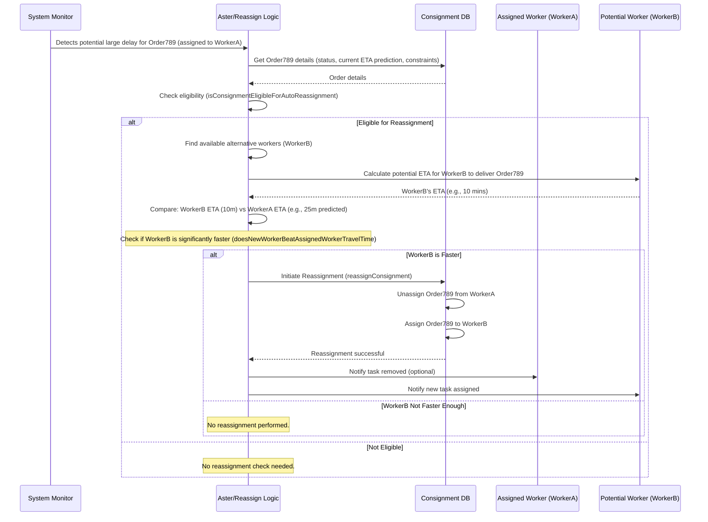
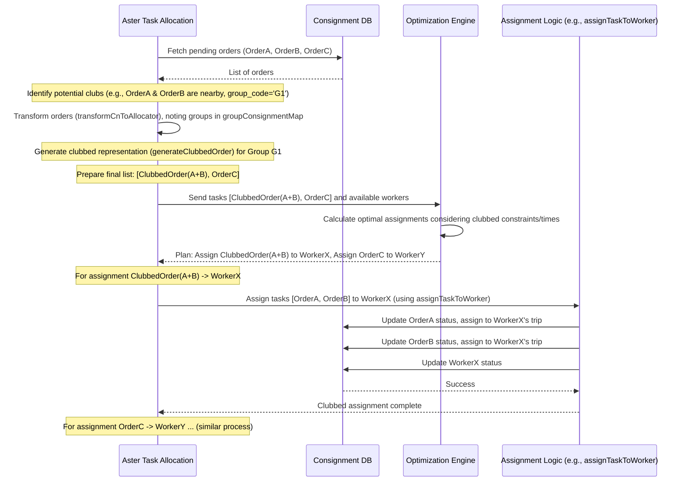

# Chapter 6: Auto-Reassignment & Clubbing Logic - Smart Delivery Adjustments

Welcome back! In [Chapter 5: Worker Prioritization Strategy](05_worker_prioritization_strategy.md), we learned how `projectx` ranks eligible workers to choose the best one for a job. This helps [Aster](03_task_allocation_orchestrator__aster_.md), our delivery matchmaker, make intelligent initial assignments.

But what happens *after* an order is assigned? Deliveries face real-world challenges like traffic jams. Also, couldn't we be even smarter by grouping nearby orders together?

This chapter introduces two advanced features that handle these situations: **Auto-Reassignment** and **Clubbing Logic**. Think of them as smart adjustments the system makes to keep deliveries running smoothly and efficiently.

## What's the Big Idea? Backup Drivers and Delivery Carpools

Imagine our pizza delivery scenario again:

1.  **The Problem:** A driver picks up a pizza but gets stuck in unexpected, heavy traffic. The pizza will be very late!
2.  **The Solution (Auto-Reassignment):** The system notices the big delay. It checks if another available driver who is closer or has a clearer route could deliver it significantly faster. If yes, it automatically switches the delivery to the backup driver. It's like calling for roadside assistance and getting a new driver to finish the job when the first one has a flat tire.

Now, consider another situation:

1.  **The Opportunity:** Two separate pizza orders come in around the same time, going to addresses just a block apart.
2.  **The Solution (Clubbing):** Instead of sending two different drivers, the system identifies this opportunity. It checks if one driver can handle both (considering capacity, [Constraint Tags](04_constraint_tag_system.md), and delivery times). If possible, it bundles, or "clubs," these orders together for a single driver's trip. It's like **delivery carpooling** – one trip, multiple stops, saving time and fuel.

These two concepts – **Auto-Reassignment** (the backup plan) and **Clubbing** (the carpool strategy) – add a layer of intelligence and resilience to our task allocation process.

## Key Concepts Explained

Let's break down these two powerful features:

### 1. Auto-Reassignment: The Backup System

*   **What it is:** A safety net that automatically switches an already assigned delivery to a different worker if the original assignment is predicted to fail badly (usually due to significant delays).
*   **How it triggers:** The system continuously monitors assigned tasks. Using real-time traffic data and worker locations, it predicts delivery times. If a prediction shows a major delay (e.g., exceeding the delivery window by a large margin), it flags the task for potential reassignment.
*   **The Process:**
    1.  **Eligibility Check:** Is this order even allowed to be auto-reassigned? (Based on configuration and how many times it might have already been reassigned).
    2.  **Find Alternatives:** Look for other available workers (using criteria from [Chapter 5](05_worker_prioritization_strategy.md)) who could potentially take over.
    3.  **Compare ETAs:** Calculate the estimated delivery time for the *current* worker vs. the *alternative* workers.
    4.  **Beat the Clock:** Does any alternative worker offer a *significantly faster* delivery time (based on a configured threshold)?
    5.  **Perform the Switch:** If a better alternative is found, the system automatically:
        *   Unassigns the task from the original worker.
        *   Assigns the task to the new, faster worker.
        *   Updates statuses and potentially recalculates routes.
*   **Where it happens:** This logic is often checked periodically or triggered when significant delay events are detected, working alongside [Aster](03_task_allocation_orchestrator__aster_.md).

### 2. Clubbing Logic: Delivery Carpooling

*   **What it is:** The process of grouping multiple separate orders, typically heading to nearby locations, into a single trip for one worker.
*   **Why it's useful:** Increases efficiency! Reduces the number of drivers needed, lowers fuel consumption, and can potentially speed up deliveries overall by optimizing routes.
*   **The Process:**
    1.  **Identify Candidates:** As new orders ([Ondemand Consignment Model](01_ondemand_consignment_model.md)) become available, the system (usually [Aster](03_task_allocation_orchestrator__aster_.md)) looks for potential clubbing opportunities – orders with destinations close to each other.
    2.  **Check Constraints:** Can a single worker realistically handle the combined orders? This involves:
        *   **Capacity:** Does the combined weight/volume fit the worker's vehicle?
        *   **Tags:** Does the worker meet *all* the [Constraint Tags](04_constraint_tag_system.md) required by *all* the orders in the potential club?
        *   **Time Windows:** Can the worker pick up and deliver *all* orders within their respective time windows, even when grouped? This might involve merging or slightly adjusting time windows if configurations allow.
        * **Order Source Compatibility:** Some orders from specific sources might not be allowed to be clubbed with others.
    3.  **Data Transformation:** If checks pass, the system might represent the clubbed orders as a single "bundle" or group for planning purposes. This involves:
        *   Assigning a common `group_id`.
        *   Calculating combined weight/volume.
        *   Listing all required constraint tags.
        *   Defining the effective combined time window.
    4.  **Assign the Bundle:** The optimizer within Aster, or the assignment logic itself, treats this bundle as a single unit to be assigned to the best-suited [Ondemand Worker Model](02_ondemand_worker_model.md).
*   **Where it happens:** This logic is typically applied *during* the task allocation process run by [Aster](03_task_allocation_orchestrator__aster_.md), often before calling an optimization engine or making direct assignments.

## Using Auto-Reassignment (Conceptual Examples)

Auto-reassignment usually runs behind the scenes. You configure it, and the system takes care of monitoring and execution.

**1. Checking if Reassignment is Needed (Conceptual)**

Imagine a monitoring part of the system checking an assigned order (`ORDER789`) currently with `WorkerA`.

```javascript
// Import functions from the auto-reassignment utility file
const {
    isConsignmentEligibleForAutoReassignment,
    // ... other functions like doesNewWorkerBeatAssignedWorkerTravelTime
} = require('./auto-reassignment-utils');

// --- Inside a monitoring loop or triggered event ---
const consignmentData = { /* Data for ORDER789, status: 'assigned_for_delivery' */ };
const assignedWorkerTravelTimeSec = 900; // Predicted time for WorkerA (15 mins)
const currentTimeSeconds = Date.now() / 1000;
const workerSlotManagementConfig = { /* config for time slots */ };
const reassignmentConfig = { // Settings from config
    delay_buffer_percent: 20, // e.g., Reassign if predicted delay > 20% of allowed time
    max_retries: 2            // e.g., Max 2 reassignments per order
};

// Check if this order *could* be reassigned based on rules and current delay prediction
const isEligible = isConsignmentEligibleForAutoReassignment({
    currentTimeSeconds,
    workerSlotManagementConfig,
    consignment: consignmentData,
    reassignmentConfig
});

console.log(`Is ${consignmentData.reference_number} eligible for auto-reassignment? ${isEligible}`);

if (isEligible) {
    // If eligible, NOW we would look for alternative workers (WorkerB, WorkerC)
    // and compare their potential travel times using something like:
    // doesNewWorkerBeatAssignedWorkerTravelTime({ ..., newWorkerArrivalTimeSec: 600, assignedWorkerTravelTime: 900, ... })
    // If a significantly faster worker is found, trigger the reassignment process.
}
```

This code snippet shows the *check* that happens. It uses a helper function `isConsignmentEligibleForAutoReassignment` to see if the order's current predicted delay makes it a candidate for reassignment according to the rules.

**2. Performing the Reassignment (Conceptual)**

If the check passes and a faster worker (`WorkerB`) is found, another function handles the switch.

```javascript
// Import the reassignment function
const { reassignConsignment } = require('./auto-reassignment-utils');

// --- Assume WorkerB is found to be faster ---
const organisationId = 'YOUR_ORG_ID';
const extendedModels = { /* Database tools */ };
const orderToReassign = { reference_number: 'ORDER789', hub_id: 'HUB01' };
const oldWorkerId = 'WorkerA_ID';
const newWorkerInfo = { worker_code: 'WKR_B', worker_id: 'WorkerB_ID' };
const optimizerEtaInfoForNewWorker = { arrival: /* predicted arrival time for WorkerB */ };

try {
    // This function handles unassigning from WorkerA and assigning to WorkerB
    await reassignConsignment(organisationId, extendedModels, {
        oldWorkerId: oldWorkerId,
        currentTime: new Date(),
        hubId: orderToReassign.hub_id,
        newWorkerCode: newWorkerInfo.worker_code,
        referenceNumber: orderToReassign.reference_number,
        optimizerEtaInfo: optimizerEtaInfoForNewWorker,
        reassignedIndex: 0 // Position in the new worker's trip
    });
    console.log(`Successfully reassigned ${orderToReassign.reference_number} from ${oldWorkerId} to ${newWorkerInfo.worker_code}.`);

} catch (error) {
    console.error("Auto-reassignment failed:", error);
    // Log error, maybe the order state changed again
}
```

This conceptual code calls `reassignConsignment`, which encapsulates the database operations to switch the order's assignment from the delayed worker to the faster one.

## Using Clubbing Logic (Conceptual Examples)

Clubbing happens during task allocation, often when preparing data for assignment.

**1. Preparing Orders with Group Info (Conceptual)**

When [Aster](03_task_allocation_orchestrator__aster_.md) fetches orders, it might identify potential clubs and add grouping information.

```javascript
// Import the transformation function used by Aster
const { transformCnToAllocator } = require('./aster-task-allocation');

// Assume Aster fetched two nearby orders: ORDER_A and ORDER_B
const orderA = { reference_number: 'ORDER_A', destination_pincode: '110011', group_code: 'NEARBY_GROUP_1', /* other details */ };
const orderB = { reference_number: 'ORDER_B', destination_pincode: '110011', group_code: 'NEARBY_GROUP_1', /* other details */ };
const orderC = { reference_number: 'ORDER_C', destination_pincode: '220022', /* No group */ /* other details */ };

const allocatorConsignmentList = [];
const groupConsignmentMap = {}; // Used to store details of orders within a group
const options = { /* deliveryServiceTimePerConsignment, allocationType, etc. */ };

// Process Order A - Belongs to a group
transformCnToAllocator(allocatorConsignmentList, orderA, options, groupConsignmentMap);
// Process Order B - Belongs to the SAME group
transformCnToAllocator(allocatorConsignmentList, orderB, options, groupConsignmentMap);
// Process Order C - Not part of a group
transformCnToAllocator(allocatorConsignmentList, orderC, options, groupConsignmentMap);

// 'groupConsignmentMap' now holds details for NEARBY_GROUP_1: [ {order A details}, {order B details} ]
// 'allocatorConsignmentList' might initially just contain ORDER_C if group logic is handled later.
// OR, a special "grouped" representation might be added later.
console.log("Group Map Keys:", Object.keys(groupConsignmentMap)); // Output: ['nearby_group_1']
```

This code shows how `transformCnToAllocator` is used. Orders with the same `group_code` are noted in the `groupConsignmentMap`. This map is later used to potentially create a single "clubbed" order representation.

**2. Generating a Clubbed Order Representation (Conceptual)**

Aster might then take the `groupConsignmentMap` and create a single entry representing the clubbed order.

```javascript
// Import the clubbing function used by Aster
const { generateClubbedOrder } = require('./aster-task-allocation'); // Assuming this exists

// Assume 'groupConsignmentMap' has data for 'nearby_group_1' from the previous step
const ordersInGroup = groupConsignmentMap['nearby_group_1']; // Contains transformed data for Order A and B

// Generate a single object representing the clubbed order
const clubbedOrder = generateClubbedOrder(ordersInGroup);

// clubbedOrder might look like:
// {
//   group_id: 'nearby_group_1',
//   reference_number: 'ORDER_A', // Uses first order's ref as representative?
//   weight: /* Combined weight of A + B */,
//   constraint_tags: [ /* ALL tags required by A or B */ ],
//   tw_open: /* Earliest start time of A or B */,
//   tw_close: /* Latest end time of A or B */,
//   service_time: /* Max service time of A or B */,
//   pickup_service_time: /* Sum of pickup times */,
//   consignments_count: 2,
//   // ... other potentially merged fields ...
// }

// Now, Aster might add 'clubbedOrder' to the list sent to the optimizer,
// replacing the individual Order A and Order B entries for that group.
const finalAllocatorList = []; // Replace individual orders with clubbed representation
// finalAllocatorList.push(clubbedOrder);
// finalAllocatorList.push(transformedOrderC); // Order C is still separate

console.log(`Generated clubbed order for group: ${clubbedOrder.group_id} with ${clubbedOrder.consignments_count} items.`);
```

This code shows the concept of taking multiple individual order details identified as a potential club and using `generateClubbedOrder` to create a single summary object. This summary object simplifies planning for the optimizer or assignment logic.

## Under the Hood

Let's peek behind the curtain to see how these processes work internally.

### Auto-Reassignment Flow



*   **Key Checks:** `isConsignmentEligibleForAutoReassignment` verifies rules like max retries and delay severity. `doesNewWorkerBeatAssignedWorkerTravelTime` compares the predicted times to see if the switch is worthwhile.
*   **Action:** `reassignConsignment` performs the database updates to switch the worker, update statuses, and log the event.
*   **Code Location:** Core logic resides in `common/models/internal-api-parts/jfl-parts/auto-reassignment-utils.js`.

### Clubbing Flow (within Aster)



*   **Identification:** Potential clubs are often identified based on shared attributes like `group_code` assigned during order creation or geographical proximity calculated by Aster.
*   **Transformation:** `transformCnToAllocator` prepares individual order data, and functions like `generateClubbedOrder` create the summarized representation for planning.
*   **Execution:** The final assignment (e.g., via `assignTaskToWorker`) still assigns the *individual* consignments within the club to the chosen worker, ensuring each order is tracked correctly, even though they were planned as a bundle.
*   **Code Location:** Clubbing logic is integrated within `common/models/internal-api-parts/jfl-parts/aster-task-allocation.js`.

## Conclusion

Auto-Reassignment and Clubbing Logic are like the smart assistants helping our delivery system adapt and optimize.

*   **Auto-Reassignment** acts as a crucial backup, automatically swapping drivers when significant delays threaten an order, improving reliability.
*   **Clubbing** leverages efficiency, finding opportunities to group nearby orders onto single trips, like a delivery carpool system, saving resources.

These features, often working automatically within or alongside [Aster](03_task_allocation_orchestrator__aster_.md), build upon the core concepts of orders ([Chapter 1](01_ondemand_consignment_model.md)), workers ([Chapter 2](02_ondemand_worker_model.md)), constraints ([Chapter 4](04_constraint_tag_system.md)), and prioritization ([Chapter 5](05_worker_prioritization_strategy.md)) to create a more robust and efficient delivery operation.

But how do we control *when* these features are active, set thresholds for delays, or configure other operational parameters? That's where configuration comes in. In the final chapter, we'll explore the settings and tools that let you customize how `projectx` operates: [OnDemand Configuration & Utilities](07_ondemand_configuration___utilities.md).

---

Generated by [AI Codebase Knowledge Builder](https://github.com/The-Pocket/Tutorial-Codebase-Knowledge)