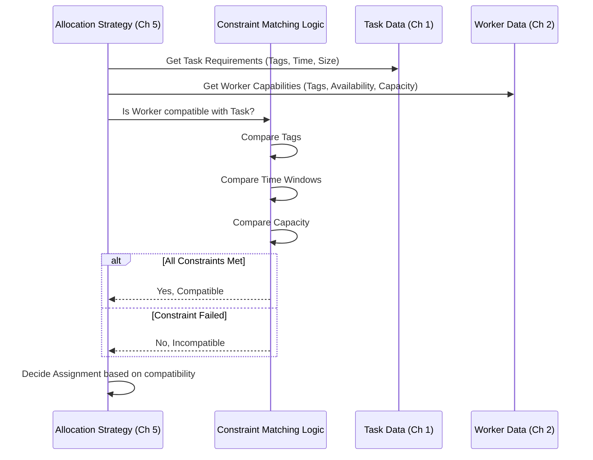

# Chapter 6: Constraint Matching Logic

In [Chapter 5: Allocation Strategy Execution](05_allocation_strategy_execution.md), we saw how ProjectX uses different strategies (like external optimizers or rule-based systems) to decide which worker gets which delivery task. We have the tasks, the workers, and a strategy.

But wait! Before we finalize an assignment, we need to make absolutely sure the worker *can actually handle* the specific requirements of the task. Just because a driver is available doesn't mean they can deliver *anything*. Maybe the order needs special handling, or the customer is paying with cash, and not all drivers are equipped or authorized for that.

This chapter focuses on **Constraint Matching Logic**: the critical step of verifying that a worker and their vehicle meet all the specific requirements (constraints) of a consignment before assigning it.

## What's the Big Idea?

Imagine you're ordering a large, frozen ice cream cake for a party. When the delivery company assigns a driver, you wouldn't want them showing up on a bicycle on a hot day! You need someone with a vehicle that has a freezer.

Constraint Matching is like the delivery company's checklist:
1.  **Task Requirement:** Ice Cream Cake (Needs `refrigerated` transport).
2.  **Worker Capability:** Driver Bob has a van with a freezer (`refrigerated` tag).
3.  **Match?** Yes! Bob is compatible.

Or another scenario:
1.  **Task Requirement:** Pay with Cash on Delivery (`cod_enabled` needed).
2.  **Worker Capability:** Driver Alice is not authorized to handle cash (doesn't have `cod_enabled` tag).
3.  **Match?** No! Alice is not compatible for *this specific task*, even if she's available.

This matching logic ensures we don't assign tasks to workers who can't successfully complete them due to specific requirements. It prevents mismatches like sending a bike for a heavy package or a driver without cash handling training for a COD order.

## What Kinds of Constraints Are Checked?

The system checks various types of requirements:

1.  **Vehicle Features (`constraint_tags`):**
    *   Does the task need a `refrigerated` vehicle? Does the worker's vehicle have it?
    *   Does the task need a `large_van`? Is the worker using one?
    *   Does the task require specific equipment (e.g., `payment_terminal`)?
2.  **Worker Permissions/Skills (`constraint_tags`):**
    *   Is it Cash on Delivery (`cod_enabled`)? Is the worker allowed to handle cash?
    *   Does the task involve specific handling (e.g., `fragile_handling_trained`)? Does the worker have the training?
3.  **Time Windows:**
    *   Does the delivery need to happen between 2 PM and 4 PM?
    *   Is the worker's shift active during that time? Can they realistically reach the destination within that window, considering their current location and other tasks?
4.  **Capacity:**
    *   How heavy or large is the package (`weight`, `volume`)? Does it exceed the worker's vehicle capacity?
    *   How many orders can the worker handle (`consignment_capacity`)? Are they already full?
5.  **Location/Zone Restrictions:**
    *   Sometimes tasks or workers are restricted to specific geographical zones.

These constraints are often stored as **tags** (like `refrigerated`, `cod_enabled`) in the `extra_details` of the consignment or vehicle/worker records in the database, as we saw in [Chapter 1: Consignment Data Handling](01_consignment_data_handling.md) and [Chapter 2: Worker Data Handling](02_worker_data_handling.md).

## How Does the Matching Work?

The core idea is simple: **compare the requirements of the task with the attributes of the worker/vehicle.**

Let's look at a few common checks:

**1. Tag Matching:**

This is the most common type. The system checks if the tags required by the consignment are present in the tags associated with the worker or their vehicle.

*   **Consignment Requirements:** `["refrigerated", "cod_enabled"]`
*   **Worker/Vehicle Attributes:** `["cod_enabled", "fast_delivery_zone_A"]`

Is there a match?
*   `refrigerated`: No (Worker doesn't have it)
*   `cod_enabled`: Yes (Worker has it)

Since not all requirements are met (missing `refrigerated`), this worker is **not** compatible with this task.

**2. Time Window Matching:**

The system checks if the task's required delivery window overlaps sufficiently with the worker's available time (considering their shift and current progress).

*   **Task Time Window:** 14:00 - 16:00
*   **Worker Availability:** 13:00 - 17:00

Is there a match? Yes, the task window fits within the worker's availability.

*   **Task Time Window:** 17:30 - 18:30
*   **Worker Availability:** 13:00 - 18:00

Is there a match? No, the worker's shift ends before the task window closes.

**3. Capacity Matching:**

The system checks if adding the task would exceed the worker's limits.

*   **Task:** Weight = 5kg, Size = 1 "order slot"
*   **Worker:** Max Weight = 20kg, Max Orders = 10, Current Load = 8kg, 6 orders

Is there a match?
*   Weight Check: 8kg (current) + 5kg (task) = 13kg <= 20kg (max)? Yes.
*   Order Count Check: 6 (current) + 1 (task) = 7 orders <= 10 (max)? Yes.

Match! The worker has enough capacity.

These checks are performed during the [Allocation Strategy Execution](05_allocation_strategy_execution.md).
*   In **Rule-Based** strategies, these checks are often explicit `if` conditions within the code.
*   In **External Optimizer** strategies, these constraints (tags, capacity limits, time windows) are typically sent *to* the optimizer, which performs the complex matching as part of finding the best assignments.

## Under the Hood: Where Does This Happen?

Constraint matching isn't usually a single, separate block of code. It's woven into the fabric of the allocation strategies.

**1. Conceptual Flow:**

During allocation, when considering pairing a task with a worker, the system needs to ask: "Is this pairing valid according to the constraints?"



This diagram shows the `Allocation Strategy` gathering information about the task and worker, then using the `Constraint Matching Logic` to check for compatibility before making an assignment decision.

**2. Code Snippets (Simplified Examples):**

Let's look at how these checks might appear in different parts of the system.

**a) Tag Matching (Rule-Based / Sequential Strategy):**

Imagine a simple check within a loop that tries to assign `task` to `worker`. This might use a helper function from `tag-utils.js`.

```javascript
// Conceptual code inside an allocation strategy (e.g., jfl-task-allocation.js)

// Assume 'task.required_tags' is ["refrigerated"]
// Assume 'worker.vehicle_tags' is ["cod_enabled"]

function areTagsCompatible(taskTags = [], workerTags = []) {
  // Check if ALL task tags are present in the worker tags
  return taskTags.every(tag => workerTags.includes(tag));
}

// Inside the assignment loop...
const task = /* ... current task details ... */ ;
const worker = /* ... current worker details ... */ ;

const taskTags = task.constraint_tags || [];
const workerTags = worker.vehicle_constraint_tags || []; // Or worker tags directly

if (areTagsCompatible(taskTags, workerTags)) {
  // Tags match! Proceed with other checks (time, capacity)...
  console.log(`Worker ${worker.worker_code} is tag-compatible with task ${task.reference_number}`);
  // ... check time window ...
  // ... check capacity ...
  // if (all_checks_pass) { assign task; }

} else {
  // Tags don't match. Skip this worker for this task.
  console.log(`Worker ${worker.worker_code} NOT tag-compatible with task ${task.reference_number}`);
}

```

*   We define a simple `areTagsCompatible` function that checks if every tag in `taskTags` exists in `workerTags`.
*   The main logic retrieves the tags for the current task and worker.
*   It calls the compatibility function. If it returns `true`, other checks proceed; otherwise, the worker is skipped for that task.
*   You might find more sophisticated logic in `common/models/domain-models/ondemand-handler/task-allocation/tag-utils.js`.

**b) Time Window Matching (Conceptual):**

Checking if a task's delivery window fits within a worker's availability.

```javascript
// Conceptual check

function areTimeWindowsCompatible(taskStartStr, taskEndStr, workerAvailableStart, workerAvailableEnd) {
  // Convert time strings (e.g., "14:00") or timestamps to comparable values (e.g., minutes from midnight or Date objects)
  const taskStart = /* ... parse taskStartStr ... */;
  const taskEnd = /* ... parse taskEndStr ... */;
  const workerStart = /* ... parse workerAvailableStart ... */;
  const workerEnd = /* ... parse workerAvailableEnd ... */;

  // Check for overlap: Task must start after worker starts AND end before worker ends.
  // A more robust check considers minimum duration needed.
  const startsAfterWorkerStart = taskStart >= workerStart;
  const endsBeforeWorkerEnd = taskEnd <= workerEnd;
  // Basic overlap check: Max(starts) < Min(ends)
  const hasOverlap = Math.max(taskStart, workerStart) < Math.min(taskEnd, workerEnd);

  return hasOverlap && startsAfterWorkerStart && endsBeforeWorkerEnd;
}

// Inside the assignment loop...
const task = /* ... { time_window_start: "14:00", time_window_end: "16:00" } ... */ ;
const worker = /* ... { availability_start_time: "13:00", availability_end_time: "17:00" } ... */ ;

if (areTimeWindowsCompatible(task.time_window_start, task.time_window_end, worker.availability_start_time, worker.availability_end_time)) {
  console.log("Time window compatible.");
  // ... proceed with other checks ...
} else {
  console.log("Time window incompatible.");
  // ... skip worker ...
}
```

*   This function (conceptually) parses the time strings.
*   It performs checks to ensure the task window is fully contained within the worker's availability window and that there's a valid overlap. (Real checks can be more complex, involving travel time estimates).

**c) Capacity Matching (Conceptual):**

Checking weight and order count limits.

```javascript
// Conceptual check

const task = { weight_kg: 5, /* other details */ };
const worker = {
  capacity: { weight_kg: 20, orders: 10 },
  current_load_weight: 8,
  current_load_orders: 6
};

// Calculate potential new load
const potentialWeight = worker.current_load_weight + task.weight_kg;
const potentialOrders = worker.current_load_orders + 1; // Assuming task is 1 order

// Check against worker's capacity
const weightOK = potentialWeight <= worker.capacity.weight_kg;
const ordersOK = potentialOrders <= worker.capacity.orders;

if (weightOK && ordersOK) {
  console.log("Capacity check passed.");
   // ... proceed with other checks ...
} else {
  console.log(`Capacity check failed: Weight ${potentialWeight}/${worker.capacity.weight_kg}, Orders ${potentialOrders}/${worker.capacity.orders}`);
   // ... skip worker ...
}
```

*   This snippet calculates the worker's load *if* the task were assigned.
*   It compares the potential load against the worker's maximum capacity for both weight and order count.

**d) External Optimizer Strategy:**

In strategies like those used in `ondemand-task-allocation.js` or `aster-task-allocation.js`, these checks aren't usually done directly in ProjectX code. Instead, the constraints are packaged and sent to the external optimizer API.

```javascript
// Simplified snippet showing data prep for an optimizer

const tasksForAllocator = tasks.map(task => ({
  reference_number: task.task_id,
  lat: task.delivery_location.lat,
  lng: task.delivery_location.lng,
  tw_open: task.time_window_start, // e.g., "14:00"
  tw_close: task.time_window_end,  // e.g., "16:00"
  weight: task.required_capacity.weight || 0,
  // ---> Send constraints as tags <---
  constraint_tags: task.constraint_tags || [],
  restricted_constraint_tags: task.restricted_tags || [], // e.g., only specific workers allowed
  // ... other task details
}));

const workersForAllocator = workers.map(worker => ({
  worker_code: worker.worker_code,
  worker_id: worker.worker_id,
  consignment_capacity: worker.capacity.orders || 10,
  weight: worker.capacity.weight_kg || 20,
  delivery_time_start: worker.availability_start_time, // Worker's shift start (relative)
  delivery_time_end: worker.availability_end_time,   // Worker's shift end (relative)
  // ---> Send capabilities as tags <---
  constraint_tags: worker.constraint_tags || [],
  // ... other worker details like start location, speed ...
}));

// --- Prepare the full payload for the optimizer ---
const allocatorParams = {
  task_list: tasksForAllocator,
  vehicles: workersForAllocator, // Note: workers are often called 'vehicles' by optimizers
  // ... other settings like hub location, API keys ...
};

// --- Call the optimizer API ---
// const optimizerResponse = await callOptimizer(allocatorParams);
// The optimizer internally performs the constraint matching.

```

*   Notice how `constraint_tags`, capacity (`weight`, `consignment_capacity`), and time windows (`tw_open`, `tw_close`, `delivery_time_start`, `delivery_time_end`) are included in the data sent to the optimizer (`allocatorParams`).
*   The external optimizer uses this information to ensure it only creates assignments that respect these constraints. ProjectX trusts the optimizer to handle the matching.

## Conclusion

Great job! You've learned about **Constraint Matching Logic**, the essential "checklist" step that guarantees compatibility between tasks and workers.

You now understand:
*   **Why** constraint matching is crucial: To ensure workers can actually perform the specific tasks assigned to them.
*   **What** types of constraints are checked: Vehicle features, worker skills/permissions, time windows, capacity, location.
*   **How** matching works: Comparing task requirements (often as tags) against worker/vehicle attributes.
*   **Where** it happens: Embedded within allocation strategies, either as direct code checks (rule-based) or handled by external optimizers.

This ensures that the assignments generated by the system are not just theoretically possible, but practically feasible.

So far, we've focused mainly on workers who are part of a regular fleet. But what about gig workers or those who operate more flexibly? The next chapter explores a specific model designed for these types of workers.

**Next:** [Chapter 7: Ondemand Worker Model](07_ondemand_worker_model.md)

---

Generated by [AI Codebase Knowledge Builder](https://github.com/The-Pocket/Tutorial-Codebase-Knowledge)