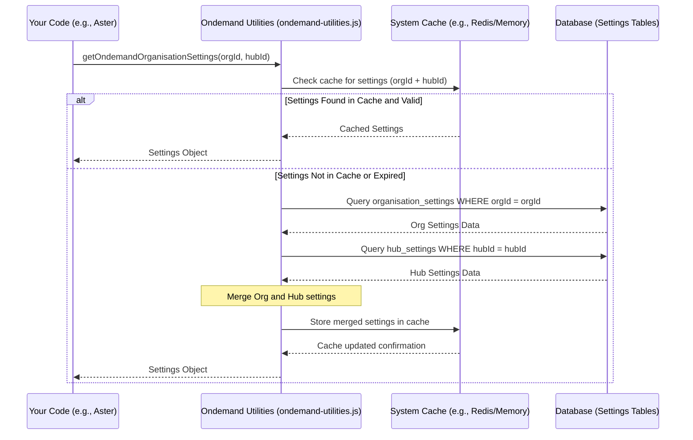

# Chapter 7: OnDemand Configuration & Utilities - The Project Toolbox

Welcome to the final chapter of our core `projectx` on-demand system tutorial! In [Chapter 6: Auto-Reassignment & Clubbing Logic](06_auto_reassignment___clubbing_logic.md), we saw how the system makes smart adjustments like finding backup drivers or grouping orders. But how does it know *when* to do these things? How are settings like delay thresholds, feature flags, or business rules managed across the system?

That's where our central **OnDemand Configuration & Utilities** come in.

## What's the Big Idea? Your System's Toolbox and Settings Panel

Imagine you're building something complex, maybe a model airplane or assembling furniture. You'll likely have:
1.  A **Toolbox:** Containing common tools you need repeatedly – screwdrivers, wrenches, measuring tape, maybe some glue.
2.  An **Instruction Manual / Settings Panel:** Telling you *how* to use the tools and specific settings – how tight to screw a bolt, how long to wait for glue to dry, which parts go where.

In `projectx`, the "OnDemand Configuration & Utilities" module acts exactly like this:

*   **The Toolbox (Utilities):** It's a central library (`ondemand-utilities.js`) filled with shared helper functions that many different parts of the on-demand system need. Think of tools for:
    *   Working with dates and times (calculating differences, formatting).
    *   Generating unique reference numbers.
    *   Validating inputs (like checking if a phone number format is correct).
    *   Performing common calculations (like Cash-On-Delivery limits).
    *   Interacting with external services in a standardized way (like getting map data or storing files).
*   **The Settings Panel (Configuration):** It provides a standard way to access system settings and business rules. These settings control how the system behaves. Examples:
    *   `allocation_delay`: How long should an order wait before being automatically assigned?
    *   `max_orders_per_worker`: What's the maximum number of orders a driver can handle at once?
    *   `auto_reassignment_enabled`: Should the system automatically reassign heavily delayed orders (like we saw in [Chapter 6](06_auto_reassignment___clubbing_logic.md))?
    *   `cod_limit_amount`: What's the maximum cash amount a driver can carry?

By having these utilities and configuration access points in one central place, we avoid duplicating code and make it much easier to manage and update the system's behavior.

## Key Areas Covered

This central module provides functionality in several key areas:

1.  **Configuration Access:** Functions like `getOndemandOrganisationSettings` allow other modules (like [Aster](03_task_allocation_orchestrator__aster_.md)) to easily fetch settings. These settings might be specific to the entire organization or tailored for a particular hub (store/warehouse).
2.  **Date & Time Helpers:** Functions for common date/time operations needed across the system (e.g., calculating time differences, checking if a time falls within a window).
3.  **Validation Logic:** Reusable functions to check if data is valid (e.g., validating addresses, phone numbers, or specific input formats).
4.  **Calculations:** Standardized ways to perform common business calculations, such as:
    *   Calculating the maximum Cash-On-Delivery (COD) amount a worker can handle (`workerCodLimitBreached`).
    *   Determining service times or allocation delays based on settings.
5.  **Reference Number Generation:** Helpers to create unique IDs for orders or other entities, potentially following specific formats (`getOndemandReferenceNumber`).
6.  **External Service Wrappers:** Simplified ways to interact with services like:
    *   Geocoding services (turning addresses into coordinates).
    *   AWS S3 (for file storage, like uploading proof-of-delivery images).
    *   Redis (a fast in-memory data store often used for caching or temporary data).
7.  **Payment Method Helpers:** Functions to manage and retrieve information about different payment methods used (`getCodPaymentDetails`, `getCodReconPaymentMethodsOfHub`).

## Using the Toolbox and Settings Panel (Code Examples)

Let's see how other parts of the system might use these utilities and configurations. We'll focus on *calling* these helpers, assuming they exist within our central `ondemand-utilities.js` file.

**1. Getting a Configuration Setting**

Imagine [Aster](03_task_allocation_orchestrator__aster_.md) needs to know the allocation delay before assigning tasks.

```javascript
// Import the utilities module
const ondemandUtilities = require('../../../domain-models/ondemand-handler/ondemand-utilities');
// Assume setup: organisationId, extendedModels (DB tools), hubId

async function checkAllocationDelay() {
    try {
        // Fetch all relevant on-demand settings for this org/hub
        const settings = await ondemandUtilities.getOndemandOrganisationSettings(
            organisationId,
            extendedModels,
            { /* options */ },
            { hub_id: hubId }
        );

        // Access the specific setting needed
        const allocationDelaySeconds = settings.allocation_delay || 0; // Default to 0 if not set

        console.log(`The allocation delay for hub ${hubId} is: ${allocationDelaySeconds} seconds.`);
        // Aster can now use this value in its logic.

    } catch (error) {
        console.error("Could not fetch settings:", error);
    }
}

// checkAllocationDelay();
```
This code calls `getOndemandOrganisationSettings` to load all the relevant configuration values. It then accesses the specific `allocation_delay` property from the returned settings object.

**2. Calculating a Worker's COD Limit Breach**

Let's say we need to check if a worker is carrying too much cash before assigning them a new COD order.

```javascript
// Import the utilities module
const ondemandUtilities = require('../../../domain-models/ondemand-handler/ondemand-utilities');
// Assume setup: workerData (profile), codTransactions (list of cash held), hubCodConfig, timezone

// Worker's current cash balance
const currentWorkerCredits = 5500;
// Oldest cash transaction time for this worker
const oldestTransactionTime = '2023-10-25T10:00:00Z'; // Example date

try {
    // Use the utility function to check the limit
    const isBreached = ondemandUtilities.workerCodLimitBreached({
        timezone: timezone,
        hubCodConfiguration: hubCodConfig, // Rules like [{ rider_type: 'ft', max_cod_limit: 5000, max_limit_in_days: 2 }]
        codTransactions: codTransactions, // List of cash amounts collected
        workerType: workerData.jfl_worker_type, // e.g., 'ft' (Full Time)
        workerCredits: currentWorkerCredits,
        oldestCodTransactionTime: oldestTransactionTime
    });

    if (isBreached) {
        console.log(`Worker ${workerData.worker_code} has breached the COD limit! Cannot assign more COD orders.`);
    } else {
        console.log(`Worker ${workerData.worker_code} is within COD limits.`);
    }

} catch (error) {
    console.error("Error checking COD limit:", error);
}
```
Here, we call `workerCodLimitBreached` from our utility library, passing in all the necessary information (worker's cash, hub rules, transaction history). The function returns a simple `true` or `false`.

**3. Getting Payment Details for an Order**

When displaying order details, we might need to format the payment information correctly.

```javascript
// Import the utilities module
const ondemandUtilities = require('../../../domain-models/ondemand-handler/ondemand-utilities');
// Assume setup: organisationId, extendedModels, orderReferenceNumber

async function displayPaymentInfo() {
    try {
        // Fetch formatted payment details using the utility
        const paymentDetails = await ondemandUtilities.getCodPaymentDetails(
            organisationId,
            extendedModels,
            { referenceNumber: orderReferenceNumber }
        );

        // paymentDetails might be: [{ mode: 'cash', value: 150.00 }]
        // or [{ mode: 'paytm_upi', value: 250.00, transaction_id: 'T123', reference_number: 'PAYTM456' }]

        if (paymentDetails && paymentDetails.length > 0) {
            console.log(`Payment for ${orderReferenceNumber}: Mode=${paymentDetails[0].mode}, Amount=${paymentDetails[0].value}`);
        } else {
            console.log(`No payment details found for ${orderReferenceNumber}.`);
        }

    } catch (error) {
        console.error("Could not get payment details:", error);
    }
}

// displayPaymentInfo();
```
This uses `getCodPaymentDetails` to retrieve structured payment information for a specific order, hiding the complexity of how payment details are stored or interpreted based on organization settings.

## Under the Hood: How It Works

How does this central module provide these features?

1.  **Configuration (`getOndemandOrganisationSettings`):**
    *   **Reads Settings:** This function typically queries database tables (like `organisation_settings` or `hub_settings`) that store configuration values as key-value pairs or JSON objects.
    *   **Caching:** To improve performance, these settings are often cached (e.g., in memory or using Redis). The function first checks the cache. If the settings are found and haven't expired, it returns the cached version. Otherwise, it fetches from the database and updates the cache.
    *   **Merging:** It might merge organization-wide settings with hub-specific overrides to provide the final effective configuration for a given context.

2.  **Utilities (`ondemand-utilities.js`):**
    *   **Helper Functions:** This file contains various JavaScript functions, each designed to perform a specific, reusable task (like date formatting, validation, or calculations like `workerCodLimitBreached`).
    *   **External Service Logic:** For interactions with external services (AWS S3, Geocoding APIs), the utility functions act as wrappers. They handle setting up the connection, making the API call with the correct parameters, and often processing the response into a simpler format. This isolates the rest of the codebase from the specifics of each external service API.

Let's visualize fetching a configuration setting:



**Code Locations:**

*   **Primary Utility File:** `common/domain-models/ondemand-handler/ondemand-utilities.js`
    *   Contains many helper functions like `getOndemandOrganisationSettings`, `workerCodLimitBreached`, `getCodPaymentDetails`, `getOndemandReferenceNumber`, date helpers, validation helpers, etc.
    *   Also likely contains wrappers for external services like geocoding (`fetchGeocodedLatLng`), S3 (`uploadExcel`), etc.
*   **Configuration Fetching Helpers:** Functions like `getOrganisationSettingsWithCache` (possibly in `common/domain-models/organisation-settings/get-org-settings.js`) might be used internally by `getOndemandOrganisationSettings` to interact with the database and cache layers.
*   **Constants:** `common/domain-models/ondemand-handler/constants/constants.js` defines shared constants used by the utilities and other modules.

```javascript
// Inside ondemand-utilities.js (Conceptual Snippet)

const helper = require('../../../lib/helpfulls.js');
const app = require('../../../server/server');
const { getOrganisationSettingsWithCache } = require('../organisation-settings/get-org-settings');
// ... other imports ...

// --- Example: Getting Settings ---
async function getOndemandOrganisationSettings(organisationId, extendedModels, options = {}, params = {}) {
    // ... (logic to determine hub context if params.hub_id exists) ...

    // Fetch base org settings (potentially cached)
    const baseOrgSettings = await getOrganisationSettingsWithCache(organisationId, extendedModels, 'ondemandAllocationRules', options);
    const ondemandSettings = baseOrgSettings ? JSON.parse(baseOrgSettings.value) : {};

    // Fetch hub-specific settings (potentially cached)
    // const hubSettings = await getHubSpecificSettings(organisationId, extendedModels, params.hub_id, options);

    // Merge settings (hub settings override org settings)
    const finalSettings = {
        ...app.mOrganisationConfig[organisationId].ondemand_config, // Base config
        ...ondemandSettings, // DB Org settings
        // ...hubSettings // DB Hub settings
    };
    return finalSettings;
}

// --- Example: COD Limit Check ---
function workerCodLimitBreached(params) {
    const { timezone, hubCodConfiguration, workerCredits, oldestCodTransactionTime, maxLimitInDays } = params;
    // ... (complex logic comparing workerCredits to max_cod_limit) ...
    // ... (logic comparing oldestCodTransactionTime to maxLimitInDays based on timezone) ...
    let limitBreached = false;
    // if (workerCredits > max_cod_limit) limitBreached = true;
    // if (oldestCodTransactionTime is older than maxLimitInDays) limitBreached = true;
    return limitBreached;
}

module.exports = {
    getOndemandOrganisationSettings,
    workerCodLimitBreached,
    getCodPaymentDetails,
    // ... many other utility functions ...
    constants // Export constants as well
};
```
This conceptual snippet shows the structure – functions like `getOndemandOrganisationSettings` handle fetching/merging config, while others like `workerCodLimitBreached` encapsulate specific business logic calculations.

## Conclusion

Congratulations! You've reached the end of the core `projectx` on-demand system tutorial.

In this chapter, we explored the **OnDemand Configuration & Utilities** module – the essential toolbox and settings panel for our system. It centralizes common helper functions (like date manipulation, validation, calculations) and provides a standard way to access crucial system configurations (like delays, capacities, feature flags). This approach promotes code reuse, consistency, and makes the entire system easier to manage and maintain.

Throughout these chapters, you've journeyed from the basic building blocks – the `OndemandConsignment` ([Chapter 1](01_ondemand_consignment_model.md)) and `OndemandWorker` ([Chapter 2](02_ondemand_worker_model.md)) – to the intelligent core of task allocation with `Aster` ([Chapter 3](03_task_allocation_orchestrator__aster_.md)). You've seen how `Constraint Tags` ([Chapter 4](04_constraint_tag_system.md)) ensure the right worker gets the right job, how `Prioritization` ([Chapter 5](05_worker_prioritization_strategy.md)) ranks eligible workers, and how `Auto-Reassignment & Clubbing` ([Chapter 6](06_auto_reassignment___clubbing_logic.md)) provide dynamic adjustments. Finally, this chapter showed how shared utilities and configuration tie everything together.

You now have a solid foundational understanding of how the main components of the `projectx` on-demand delivery system work together. Keep exploring the codebase, and refer back to these chapters as you delve deeper!

---

Generated by [AI Codebase Knowledge Builder](https://github.com/The-Pocket/Tutorial-Codebase-Knowledge)