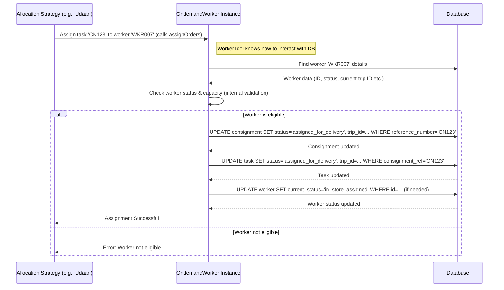

# Chapter 7: Ondemand Worker Model

Welcome back! In [Chapter 6: Constraint Matching Logic](06_constraint_matching_logic.md), we saw how ProjectX ensures that a worker meets all the specific requirements of a task before assigning it. We verified the *compatibility* between the "who" (worker) and the "what" (task).

Now, let's think about *how* the system actually performs actions related to these workers, like fetching their current workload or updating their assignments in the database. Different parts of the system, especially the various [Allocation Strategies](05_allocation_strategy_execution.md), need to do these things repeatedly.

This chapter introduces a reusable helper called the **Ondemand Worker Model** (`OndemandWorker` class), designed to make managing worker actions easier and more consistent.

## What's the Big Idea?

Imagine you're training several dispatchers (our allocation strategies). Each dispatcher needs to know how to:
1.  Look up a driver's details.
2.  Check how many deliveries a driver already has.
3.  Officially assign a new delivery slip to a driver in the system.

Instead of teaching *each* dispatcher the exact step-by-step database commands for these actions (which might be complex and change over time), you could give them a specialized **"Driver Management Tool"**. This tool has simple buttons like "Get Driver Info", "Check Current Load", and "Assign Task". The dispatcher just uses the tool, and the tool handles the complicated details behind the scenes.

The **Ondemand Worker Model (`OndemandWorker` class)** is exactly like this Driver Management Tool for ProjectX. It's a reusable piece of code that bundles together common actions related to delivery workers. Allocation strategies don't need to write their own database queries to update worker assignments; they just use the standard `OndemandWorker` tool.

## Why Have a Standard Toolkit?

Why not just let each allocation strategy handle worker updates directly? Using a standard toolkit like `OndemandWorker` provides several benefits:

*   **Avoids Repetition:** Many strategies need to perform similar worker actions (like assigning an order). Writing this logic once in `OndemandWorker` means we don't have to repeat it in every strategy file (like `jfl-task-allocation.js`, `udaan-task-allocation.js`, etc.).
*   **Consistency:** Ensures that actions like assigning an order are always done the same way, following the correct steps and updating the right database fields.
*   **Easier Maintenance:** If the way we store worker assignments changes, we only need to update the logic inside the `OndemandWorker` class, instead of hunting through multiple strategy files.
*   **Simplicity for Strategies:** The allocation strategies can focus on their main job (deciding *who* gets *what*) without worrying about the low-level details of database updates for workers.

## What Can the `OndemandWorker` Toolkit Do?

The `OndemandWorker` class provides several handy functions (methods) for interacting with worker data. Here are some key ones:

1.  **Initialize Worker Data (`initializeWorkerById`):**
    *   **Purpose:** Loads all the necessary information about a specific worker from the database (like their ID, code, status, vehicle info) into the toolkit instance.
    *   **Analogy:** Telling the Driver Management Tool, "Load up the profile for Driver 007."
2.  **Fetch Current Assigned Orders (`getAssignedAndIncompleteOrders`):**
    *   **Purpose:** Retrieves the list of tasks that the worker is currently assigned to but hasn't completed yet.
    *   **Analogy:** Asking the tool, "Show me the deliveries Driver 007 is currently working on."
3.  **Assign Orders (`assignOrders`):**
    *   **Purpose:** Performs the actual assignment. This involves updating the consignment's status, linking it to the worker's current trip, and potentially updating the worker's status in the database.
    *   **Analogy:** Pressing the "Assign this Task" button on the tool for a specific driver and delivery slip.
4.  **Create New Trip (`createNewTrip`):**
    *   **Purpose:** Used in some strategies (especially those creating assignments from scratch, like external optimizers) to create a new trip record in the database and assign tasks to it and the associated worker.
    *   **Analogy:** Using the tool to create a new route plan for a driver and adding the first set of deliveries to it.
5.  **Validate Worker (`validateWorkerForAssign`, `validateConsignmentForWorker`):**
    *   **Purpose:** Internal checks to ensure the worker is actually in a state where they can be assigned tasks (e.g., are they `onduty`? Not `on_break`? Do they have capacity?). These checks are often called automatically before assignment.
    *   **Analogy:** The tool automatically checking if the driver is clocked in and available before letting the dispatcher assign a task.

## How Allocation Strategies Use the Toolkit

Different allocation strategies ([Chapter 5: Allocation Strategy Execution](05_allocation_strategy_execution.md)) use the `OndemandWorker` toolkit to manage the final steps of assignment.

Let's look at a simplified example from the **Udaan** strategy (sequential assignment):

1.  The strategy finds an unassigned task (Consignment) and identifies a potential worker (e.g., Worker 'WKR007').
2.  It creates an instance of the toolkit specifically for this worker:
    ```javascript
    // Simplified concept from udaan-task-allocation.js
    const ondemandWorker = new OndemandWorker({
      extendedModels: extendedModels, // Database access tools
      organisationId: organisationId,
      source: 'udaan_task_allocation', // Who is using the tool
      // ... other setup details
    });
    ```
    *   This creates a new "Driver Management Tool" ready to work with.
3.  It tells the toolkit to load the worker's details:
    ```javascript
    // Simplified concept
    await ondemandWorker.initializeWorkerById({
      workerId: workerId, // e.g., the ID for 'WKR007'
      organisation_id: organisationId,
    });
    ```
    *   This is like loading Driver 007's profile into the tool.
4.  It might check the worker's current load (using `getAssignedAndIncompleteOrders`) or perform other validations implicitly.
5.  If the worker is suitable, it tells the toolkit to perform the assignment:
    ```javascript
    // Simplified concept
    const presentTime = new Date();
    await ondemandWorker.assignOrders({
      eventTime: presentTime,
      currentTime: presentTime,
      referenceNumber: consignment.reference_number, // The task to assign
      // ... other assignment options
    });
    ```
    *   This tells the tool: "Assign this `referenceNumber` to the loaded worker (WKR007)." The `OndemandWorker` instance handles all the necessary database updates.

By using `OndemandWorker`, the Udaan strategy code doesn't need to contain complex SQL `UPDATE` statements. It just calls the methods provided by the toolkit. You can see similar usage patterns in `jfl-task-allocation.js` and `aster-task-allocation.js` as well.

## Under the Hood: How the Toolkit Works

When an allocation strategy calls a method like `assignOrders`, what happens inside the `OndemandWorker` class?

**Conceptual Flow:**



1.  The **Allocation Strategy** calls a method on the **`OndemandWorker` Instance** (the toolkit).
2.  The toolkit instance might first fetch the latest worker data from the **Database**.
3.  It performs internal checks (like status, capacity).
4.  If valid, it executes the necessary **Database** operations (e.g., `UPDATE` statements on `consignment`, `task`, and potentially `worker` tables) to reflect the assignment.
5.  It reports success or failure back to the **Allocation Strategy**.

**Code Location:**

The actual code defining the `OndemandWorker` class and its methods (like `initializeWorkerById`, `assignOrders`, `createNewTrip`) resides in:
`common/models/domain-models/ondemand-handler/ondemand-worker-class/ondemand-worker-class.js`

Looking inside this file reveals the detailed logic for interacting with the database models (`Consignment`, `Trip`, `Worker`, `Task`) to perform the actions requested by the allocation strategies.

## Conclusion

Great work! You've learned about the **Ondemand Worker Model (`OndemandWorker` class)**, a crucial reusable component in ProjectX.

You now understand:
*   **Why** it exists: To provide a standard, reusable toolkit for common worker-related actions needed by various allocation strategies.
*   **What** it does: Initializes worker data, fetches current load, validates eligibility, and performs assignments/trip creation by interacting with the database.
*   **How** strategies use it: By creating an instance and calling its methods (like `initializeWorkerById`, `assignOrders`).
*   **Benefits:** Promotes code reuse, consistency, and easier maintenance.

This toolkit simplifies the job of the allocation strategies, allowing them to focus on higher-level decision-making.

So far, we've seen many parts of the system (Hub Selection, Strategies, Constraints, Worker Model) that rely on specific settings or rules. How does ProjectX manage all these different configurations? The next chapter explores how the system's behavior can be driven by configuration settings.

**Next:** [Chapter 8: Configuration-Driven Behavior](08_configuration_driven_behavior.md)

---

Generated by [AI Codebase Knowledge Builder](https://github.com/The-Pocket/Tutorial-Codebase-Knowledge)