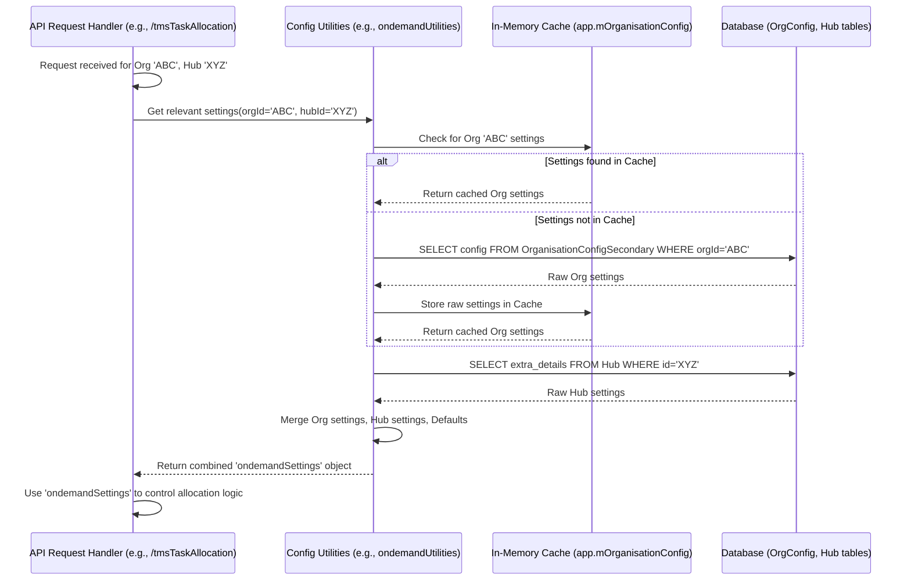

# Chapter 8: Configuration-Driven Behavior

Welcome to the final chapter of the ProjectX tutorial! In [Chapter 7: Ondemand Worker Model](07_ondemand_worker_model.md), we learned about the `OndemandWorker` toolkit, a reusable way to handle common actions related to delivery workers. Throughout the previous chapters, you might have noticed mentions of specific settings, flags, or rules that influence how the system behaves – like checking if a hub is enabled for automatic allocation or using a certain distance threshold for grouping orders.

In this chapter, we'll dive deeper into this crucial concept: **Configuration-Driven Behavior**. We'll explore how ProjectX uses settings to adapt its processes, making it flexible enough to handle the unique operational needs of different companies or even individual delivery hubs.

## What's the Big Idea?

Imagine you're developing a video game. Players expect to customize things like the difficulty level, keyboard controls, or graphics quality. You wouldn't create a completely separate version of the game for every possible combination of settings! Instead, you build the core game engine once, and then let the player *configure* it through a settings menu.

ProjectX works in a similar way for delivery logistics. Different companies or delivery hubs have vastly different rules:
*   **Company A (Fast Food):** Needs orders assigned within 5 minutes, uses mostly bikes, drivers can take max 3 orders, only delivers within a 5km radius.
*   **Company B (Large Retail):** Assigns orders planned the day before, uses vans, drivers can take up to 20 orders, uses third-party delivery partners (3PL) for overflow.
*   **Hub C (Pharmacy):** Needs refrigerated vehicles for some orders, prioritizes urgent medicine deliveries, requires specific driver training.

Hardcoding all these variations into the main ProjectX software would make it incredibly complex and impossible to maintain. Instead, ProjectX relies on **configuration**: settings stored outside the main code that tell the system *how* to operate for a specific organization or hub.

This chapter explains how these external settings control the behavior of the task allocation process, making ProjectX adaptable without needing constant code changes.

## What is Configuration in ProjectX?

Configuration refers to parameters, settings, flags, and rules that control how ProjectX functions. Instead of being written directly into the program's logic (hardcoded), these settings are typically stored elsewhere, often in:

1.  **Database Tables:**
    *   `OrganisationConfigSecondary`: Stores organization-wide settings. This is often loaded into memory when the application starts (e.g., accessible via `app.mOrganisationConfig[organisationId]`).
    *   `Hub`: The `extra_details` column (often JSON) can store settings specific to a particular hub.
2.  **Other Data Structures:** Specific strategies might read settings from dedicated tables or structures related to their function (like rules for an allocation strategy).

These settings act like a customizable operations manual for each client or hub.

**Examples of Configuration Settings:**

You'll often see configuration stored as key-value pairs. Here are some examples inspired by the code snippets you've seen:

*   From `orgConfig` or `ondemandSettings`:
    *   `max_orders_per_worker_auto_allocation`: `10` (Max orders a worker can have)
    *   `consignment_allocation_time_sec`: `300` (Delay before assigning, in seconds)
    *   `new_consignment_status_list`: `["reachedathub", "softdata_upload"]` (Which statuses trigger allocation)
    *   `create_empty_trips`: `true` (A feature flag for a specific allocation strategy)
    *   `vehicle_speed_map`: `{ "CYCLE": 15, "SCOOTER": 25 }` (Default speeds in km/h)
    *   `enable_3pl_allocation`: `false` (Feature flag for using third-party logistics)
    *   `threshold_distance_for_order_clubbing`: `200` (Max distance in meters for grouping orders)
*   From `hub.extra_details`:
    *   `enable_auto_tms_allocation`: `true` (Is this hub part of automated TMS assignments?)
    *   `is_24x7_operational`: `false` (Does the hub operate around the clock?)
    *   `service_radius_km`: `10` (Delivery radius for this hub)

## How Configuration Drives Behavior: Examples

Let's revisit some concepts from previous chapters and see how configuration settings control them.

**1. Hub Selection ([Chapter 4: Hub Selection Logic](04_hub_selection_logic.md))**

Remember how the system decides which hubs to process for TMS allocation? It checks a configuration flag!

```javascript
// Simplified concept from tms-task-allocation.js (getHubsForTmsTaskAllocation)

// Query hubs enabled for auto TMS allocation
const hubQuery = `
  SELECT hub.id AS hub_id, hub.code
  FROM hub
  WHERE hub.organisation_id = $1
    -- ---> This check reads a configuration setting from the hub's data <---
    AND (hub.extra_details->>'enable_auto_tms_allocation')::BOOLEAN IS TRUE;
`;
const enabledHubsResult = await helper.executeQueryAsync(extendedModels.Hub, hubQuery, [organisationId]);

// ... subsequent logic only processes hubs where the flag is TRUE ...
```

*   **Configuration:** The `enable_auto_tms_allocation` setting stored in the `hub` table's `extra_details` column.
*   **Behavior:** This single boolean setting determines whether the entire allocation workflow ([Chapter 3](03_task_allocation_endpoint.md), [Chapter 5](05_allocation_strategy_execution.md)) is even *triggered* for a specific hub.

**2. Fetching Data ([Chapter 1](01_consignment_data_handling.md) & [Chapter 2](02_worker_data_handling.md))**

When fetching consignments or workers, configuration often defines the criteria:

```javascript
// Simplified concept from ondemand-task-allocation.js

// --- Get settings from configuration ---
const ondemandSettings = await ondemandUtilities.getOndemandOrganisationSettings(organisationId, extendedModels);
const allocationLagTime = ondemandSettings.wait_time || 0; // e.g., 60 seconds
const statusToFetch = ondemandSettings.new_consignment_status_list || ['reachedathub']; // e.g., ["reachedathub", "unassigned"]

// --- Use settings in the query ---
const allocationTime = momentTimezone.tz(timezone).subtract(allocationLagTime, 'seconds').toDate();
const startTime = /* ... calculate start of relevant period ... */ ;

const consignmentQuery = `
  SELECT reference_number, status, /* ... */
  FROM consignment
  WHERE organisation_id = $1
    AND hub_id = $2
    AND status IN (${helper.listToSQLQueryString(statusToFetch)}) // Use configured statuses
    AND softdata_upload_time < $3                     // Use calculated allocation time
    AND softdata_upload_time >= $4;                   // Use calculated start time
`;
const queryParams = [organisationId, hubId, allocationTime, startTime];
const rawConsignments = await helper.executeQueryAsync(extendedModels.Consignment, consignmentQuery, queryParams);
```

*   **Configuration:** `ondemandSettings.wait_time`, `ondemandSettings.new_consignment_status_list`.
*   **Behavior:** These settings directly control *which* consignments are considered "ready" for allocation (based on their status and how long ago they arrived). Similarly, settings like `maximum_orders_per_worker` or `vehicle_speed_map` provide default values used when preparing worker data if specific details are missing.

**3. Allocation Strategy ([Chapter 5: Allocation Strategy Execution](05_allocation_strategy_execution.md))**

Configuration heavily influences *how* tasks are assigned:

```javascript
// Simplified concept from jfl-task-allocation.js

// --- Get settings ---
const ondemandSettings = await ondemandUtilities.getOndemandOrganisationSettings(organisationId, extendedModels);
const createEmptyTrips = ondemandSettings.create_empty_trips || false; // Feature flag
const thresholdDistance = ondemandSettings.threshold_distance_for_order_clubbing || 200; // Rule parameter

// --- Use settings to control logic flow ---
if (createEmptyTrips && multiOrderClubbing) { // Check feature flag
  // Maybe call clubbing function with the threshold distance
  const clubbedReferenceNumber = clubbingUtils.checkIfTwoConsignmentsCanBeClubbed(
    { ...ondemandSettings, threshold_distance_for_order_clubbing: thresholdDistance },
    consignment, otherConsignment, { hub_lat, hub_lng }
  );

  if (clubbedReferenceNumber) {
    // Logic specific to the 'createEmptyTrips' strategy and clubbing
    // e.g., await ondemandWorker.createNewTrip(...)
  } else {
    // Handle unclubbed orders for this strategy...
  }

} else {
  // Logic for when 'createEmptyTrips' is false or clubbing is off
  // e.g., Find an existing worker/trip
  // e.g., await ondemandWorker.assignOrders(...)
}
```

*   **Configuration:** `ondemandSettings.create_empty_trips`, `ondemandSettings.threshold_distance_for_order_clubbing`.
*   **Behavior:** The `create_empty_trips` flag acts like a switch, completely changing the code path executed. The `threshold_distance_for_order_clubbing` parameter adjusts the sensitivity of the clubbing rule. Other settings might determine which external optimizer URL to call or which set of internal rules to apply.

**4. Constraint Definitions ([Chapter 6: Constraint Matching Logic](06_constraint_matching_logic.md))**

While constraint *matching* compares task needs to worker capabilities, the *definitions* of those capabilities (like capacity) often come from configuration.

```javascript
// Simplified concept from ondemand-task-allocation.js (fetchWorkersWithShiftBetweenTime)

// --- Get settings ---
const ondemandSettings = await ondemandUtilities.getOndemandOrganisationSettings(organisationId, extendedModels);
const maxOrdersPerWorkerMap = ondemandSettings.maximum_orders_per_worker || {}; // e.g., { "CYCLE": 5, "SCOOTER": 8 }
const defaultVehicleCapacityMap = constants.defaultVehicleCapacityMap; // Fallback defaults
const vehicleCapacityMapToUse = { ...defaultVehicleCapacityMap, ...maxOrdersPerWorkerMap }; // Merge defaults and org specifics

// --- Prepare worker data using settings ---
for (const workerId in workerShiftDetails) {
  // ... fetch worker details ...
  const vehicleCategoryId = workerDetails.vehicle_category_id || constants.defaultVehicle;

  // ---> Use configured capacity for the worker's vehicle type <---
  const workerConsignmentCapacity = Number(vehicleCapacityMapToUse[vehicleCategoryId]) || null;

  const workerObj = {
    worker_id: workerId,
    // ... other details ...
    consignment_capacity: workerConsignmentCapacity, // Set capacity based on config
  };
  // ... add workerObj to list ...
}
```

*   **Configuration:** `ondemandSettings.maximum_orders_per_worker`.
*   **Behavior:** This setting defines the default capacity constraint for different vehicle types within the organization, which is then used during constraint matching in the allocation strategy.

## Accessing Configuration in Code

How does the code get access to these settings?

1.  **Cached Org Config:** Organization-wide settings are often loaded when the application starts and stored in memory for quick access. You'll frequently see this pattern:
    ```javascript
    const orgConfig = app.mOrganisationConfig[organisationId];
    const opsStart = Number(orgConfig.ops_start_hour) || 0;
    const someFeatureFlag = orgConfig?.keys_for_autoallocate?.some_feature_flag ?? false;
    ```
2.  **Helper Functions:** Specific modules often have utility functions to fetch and combine settings from various sources (org config, hub details, default constants).
    ```javascript
    // Fetches and merges settings relevant to ondemand allocation
    const ondemandSettings = await ondemandUtilities.getOndemandOrganisationSettings(organisationId, extendedModels, {}, params);
    const allocationLagTime = ondemandSettings.wait_time || 0;
    ```
3.  **Direct Database Access:** Sometimes, specific settings (especially hub-level ones) are fetched directly when needed.
    ```javascript
    const hubQuery = `SELECT extra_details FROM hub WHERE id = $1`;
    const hubResult = await helper.executeQueryAsync(extendedModels.Hub, hubQuery, [hubId]);
    const hubExtraDetails = hubResult[0]?.extra_details || {};
    const hubServiceRadius = hubExtraDetails.service_radius_km;
    ```

Once retrieved, these configuration values are used in `if` conditions, passed as parameters to functions, used in database queries, or define default values, directly influencing the system's execution path and behavior.

## Under the Hood: Loading Configuration

Loading and managing configuration efficiently is important.



1.  When a request comes in (e.g., for a specific `organisation_id` and `hub_id`), the system needs the relevant configuration.
2.  It often first checks an in-memory cache (like `app.mOrganisationConfig`) for organization-level settings. This is fast.
3.  If not cached, it queries the database (e.g., `OrganisationConfigSecondary`) and stores the result in the cache for future requests.
4.  It might then fetch hub-specific settings (like `extra_details` from the `Hub` table).
5.  Helper utilities (like `ondemandUtilities.getOndemandOrganisationSettings`) often merge these different settings sources (cached org config, fresh hub config, hardcoded defaults) into a single object (`ondemandSettings`) that the main logic can easily use.
6.  This final settings object is then used to drive the behavior of the process.

## Benefits of Configuration-Driven Behavior

*   **Flexibility:** Easily adapt ProjectX to the diverse needs of different clients, hubs, and delivery types without changing the core code.
*   **Maintainability:** Business rule changes (like changing max orders per worker) can often be done by updating configuration settings, potentially avoiding lengthy code changes, testing, and deployments.
*   **Scalability:** Onboarding new clients or hubs with unique requirements becomes much simpler – it's often just a matter of setting up their specific configuration.
*   **Experimentation:** Easily test different parameters (like allocation delays or clubbing distances) by adjusting settings.

## Conclusion

Congratulations! You've reached the end of the ProjectX tutorial. In this final chapter, you learned about **Configuration-Driven Behavior** – the powerful concept that allows ProjectX to be highly adaptable.

You now understand:
*   **Why** configuration is essential: To handle diverse operational needs without hardcoding every rule.
*   **What** configuration is: Settings stored outside the main code (in DB tables like `OrganisationConfigSecondary` or `Hub.extra_details`).
*   **How** it works: The system reads these settings (e.g., `max_orders_per_worker`, `enable_auto_tms_allocation`, `threshold_distance_for_order_clubbing`) and uses them to control logic flow, query parameters, feature availability, and default values.
*   **Benefits:** Flexibility, maintainability, and scalability.

Throughout this tutorial, we've journeyed through the core components of ProjectX's task allocation system:
1.  Gathering delivery tasks ([Consignment Data Handling](01_consignment_data_handling.md)).
2.  Finding available workers ([Worker Data Handling](02_worker_data_handling.md)).
3.  Triggering the process via endpoints ([Task Allocation Endpoint](03_task_allocation_endpoint.md)).
4.  Selecting the right hubs ([Hub Selection Logic](04_hub_selection_logic.md)).
5.  Executing different assignment strategies ([Allocation Strategy Execution](05_allocation_strategy_execution.md)).
6.  Ensuring compatibility through constraints ([Constraint Matching Logic](06_constraint_matching_logic.md)).
7.  Using reusable tools for worker actions ([Ondemand Worker Model](07_ondemand_worker_model.md)).
8.  Making the system adaptable through settings (This Chapter).

We hope this tutorial has given you a solid foundation for understanding how ProjectX works. From here, you can delve deeper into specific strategy files (like `jfl-task-allocation.js` or `aster-task-allocation.js`), explore the database schema, or even start contributing to the project!

Thank you for following along, and happy coding!

---

Generated by [AI Codebase Knowledge Builder](https://github.com/The-Pocket/Tutorial-Codebase-Knowledge)