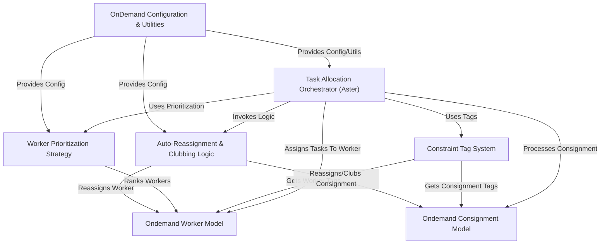

# Tutorial: projectx

This project, *projectx*, acts like an **intelligent dispatcher** for deliveries.
Its core purpose is to automatically assign delivery tasks (*Consignments*) to the best available delivery personnel (*Workers*) within a specific area (*Hub*).
It uses a central **Orchestrator (Aster)** that considers rules like worker skills/vehicle types (using *Tags*), worker availability and ranking (*Prioritization*), task requirements, and location to make efficient assignments.
It also includes features for handling **configurations**, *reassigning* tasks if delays occur, and *grouping* nearby orders for efficiency.

**Source Repository:** [https://github.com/shipsy/projectx.git](https://github.com/shipsy/projectx.git)

## Chapters

1. [Ondemand Consignment Model](01_ondemand_consignment_model.md)
2. [Ondemand Worker Model](02_ondemand_worker_model.md)
3. [Task Allocation Orchestrator (Aster)](03_task_allocation_orchestrator__aster_.md)
4. [Constraint Tag System](04_constraint_tag_system.md)
5. [Worker Prioritization Strategy](05_worker_prioritization_strategy.md)
6. [Auto-Reassignment & Clubbing Logic](06_auto_reassignment___clubbing_logic.md)
7. [OnDemand Configuration & Utilities](07_ondemand_configuration___utilities.md)

---

Generated by [AI Codebase Knowledge Builder](https://github.com/The-Pocket/Tutorial-Codebase-Knowledge)